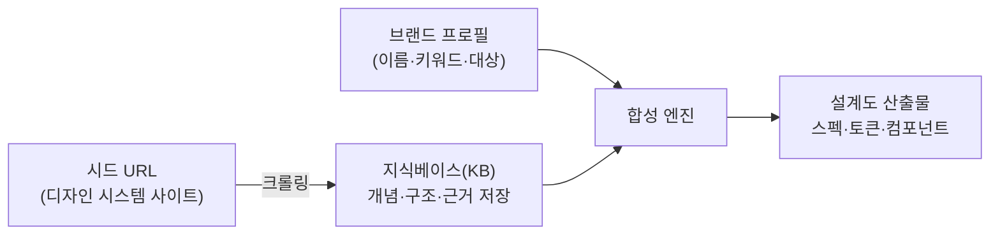
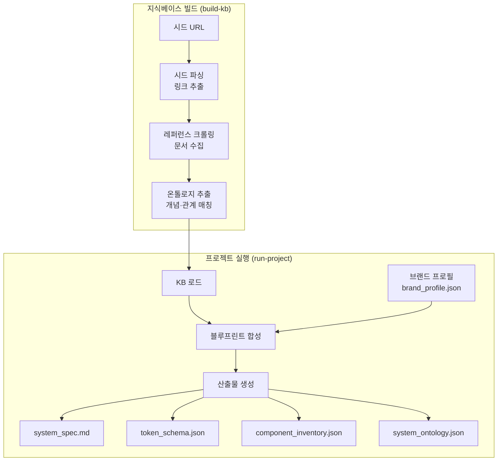
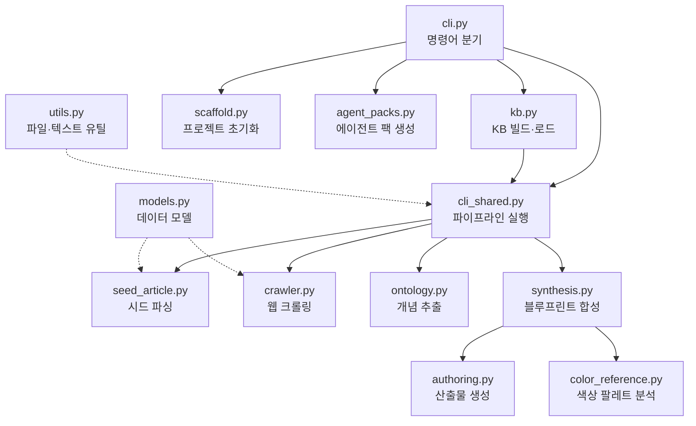

# Design Ontology Harness

다른 회사의 디자인 시스템을 참고해서, **우리 브랜드에 맞는 디자인 시스템 설계도**를 자동으로 만들어주는 도구입니다.

## 이 도구가 하는 일

1. 외부 디자인 시스템 사이트들을 읽어서 지식베이스(KB)를 만듭니다
2. 우리 브랜드 정보(이름, 키워드, 대상 사용자 등)를 입력합니다
3. KB + 브랜드 정보를 조합해서 우리만의 디자인 시스템 설계도를 생성합니다

결과물은 "남의 시스템을 복사"한 것이 아니라, 여러 레퍼런스의 구조를 참고하되 우리 브랜드 정체성에 맞게 재구성한 것입니다.

## 전체 흐름



## 핵심 개념 설명

| 용어 | 의미 |
|------|------|
| **시드 URL** | 참고할 디자인 시스템의 웹 주소. 블로그 링크 모음이나 공식 문서 URL 모두 가능 |
| **지식베이스(KB)** | 시드에서 수집한 정보를 정리해둔 저장소. 한 번 만들면 여러 프로젝트에서 재사용 |
| **브랜드 프로필** | 우리 제품의 정체성을 정의한 JSON 파일 (브랜드명, 키워드, 톤, 대상 사용자 등) |
| **토큰** | 색상·여백·글꼴 크기 같은 디자인 값을 체계적으로 정리한 변수 |
| **온톨로지** | 디자인 개념들(색상, 타이포그래피, 접근성 등) 사이의 관계를 정리한 구조 |

## 빠른 시작

### 1단계: 설치

```bash
uv sync
```

### 2단계: 지식베이스 만들기

참고할 디자인 시스템 사이트들을 수집합니다. 한 번만 하면 됩니다.

```bash
uv run design-ontology build-kb \
  --kb-dir kb/default \
  --seed-url https://carbondesignsystem.com \
  --seed-url https://primer.style
```

시드 URL은 여러 개 넣을 수 있고, 파일로도 관리할 수 있습니다.

```bash
# seeds.txt 파일에 URL을 한 줄씩 작성
uv run design-ontology build-kb \
  --kb-dir kb/default \
  --seeds-file seeds.txt
```

### 3단계: 프로젝트 만들기

```bash
uv run design-ontology init \
  --project-dir projects/my-app \
  --brand-name "My App" \
  --product-summary "팀 협업을 위한 프로젝트 관리 도구"
```

생성된 `projects/my-app/brand_profile.json`을 열어서 실제 브랜드 정보를 채워 넣으세요.

### 4단계: 설계도 생성

```bash
uv run design-ontology run-project \
  --project-dir projects/my-app \
  --kb-dir kb/default
```

### 결과 확인

`projects/my-app/build/system/blueprint/` 아래에 생성됩니다.

| 파일 | 내용 |
|------|------|
| `system_spec.md` | 디자인 원칙, 토큰 전략, 컴포넌트 정책을 정리한 설계서 |
| `token_schema.json` | 색상·여백·타이포 등 디자인 토큰의 계층 구조 |
| `component_inventory.json` | 필요한 UI 컴포넌트 목록과 상태 정의 |
| `system_ontology.json` | 브랜드→원칙→토큰→컴포넌트 관계 그래프 |

## 데이터 흐름 상세



## 모듈 구조



## CLI 명령어 목록

| 명령어 | 용도 | 핵심 옵션 |
|--------|------|-----------|
| `build-kb` | 지식베이스 만들기 | `--kb-dir`, `--seed-url`, `--seeds-file` |
| `init` | 프로젝트 초기화 | `--project-dir`, `--brand-name` |
| `run-project` | 설계도 생성 | `--project-dir`, `--kb-dir` |
| `run` | KB 없이 한번에 실행 | `--seed-url`, `--brand-profile` |
| `synthesize` | 기존 크롤 결과로 재생성 | `--output-dir`, `--brand-profile` |
| `extract-seed` | 시드에서 링크만 추출 | `--seed-url` |
| `init-agent-pack` | AI 에이전트 연동 파일 생성 | `--target-repo`, `--targets` |

## 색상 레퍼런스 (선택사항)

`brand_profile.json`에 `color_reference`를 추가하면, 로컬 색상 문서를 읽어 토큰과 설계서에 반영합니다.

```json
{
  "color_reference": {
    "path": "/path/to/color-reference.md",
    "preferred_families": ["Deep Reds", "Standard Oranges"],
    "palette_strategy": {
      "mode": "brand-guided",
      "temperature": "warm",
      "contrast": "balanced"
    }
  }
}
```

자동 모드에서는 브랜드 키워드와 색상 문서의 분위기를 바탕으로 여러 팔레트 후보를 만들고, 가장 적합한 것을 선택합니다.

## 새 참고 사이트 추가하기

새로운 디자인 시스템을 발견했을 때:

1. `build-kb`를 다시 실행하면서 새 URL을 추가합니다
2. `run-project`를 다시 실행해 산출물을 갱신합니다

```bash
# KB에 새 소스 추가
uv run design-ontology build-kb \
  --kb-dir kb/default \
  --seed-url https://새로운사이트.com

# 산출물 재생성
uv run design-ontology run-project --project-dir projects/my-app
```

브랜드 정보만 바꿨다면 `run-project`만 다시 실행하면 됩니다.

## AI 에이전트 연동 (선택사항)

생성된 설계도를 실제 코드 작업에 활용하고 싶다면, Codex나 Claude Code용 에이전트 팩을 생성할 수 있습니다.

```bash
uv run design-ontology init-agent-pack \
  --target-repo /path/to/my-project \
  --targets codex,claude
```

에이전트들은 설계도를 참고해서 코드를 작성할 때, 기존 기능을 보존하면서 점진적으로 디자인 시스템을 적용하도록 안내합니다.

## 폴더 구조

```
design_ontology_harness/   코어 프레임워크
schemas/                   입력 스키마
config/                    브랜드 프로필 예시
docs/                      설계 문서
kb/                        지식베이스 (로컬 생성, gitignore)
projects/                  프로젝트 워크스페이스
```

## 참고

- 일부 외부 사이트는 접근 제한이나 JS 렌더링 의존으로 크롤링에 실패할 수 있습니다. 실패 내역은 CLI에 요약 출력됩니다.
- 온톨로지 추출은 현재 규칙 기반입니다. LLM 기반 확장을 위한 구조가 준비되어 있습니다.
- `config/brand_profile.example.json`을 참고해 브랜드 프로필을 작성하세요.

## 라이선스

MIT. `LICENSE` 파일 참조.
