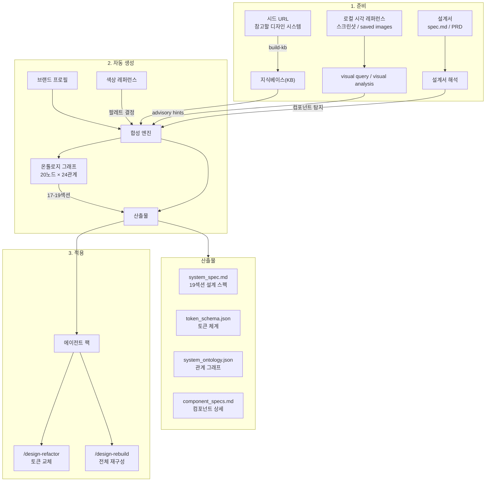
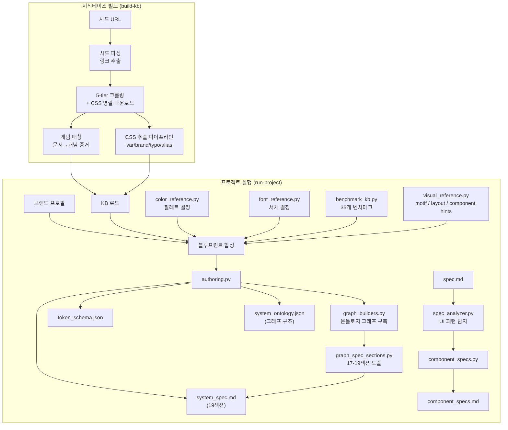
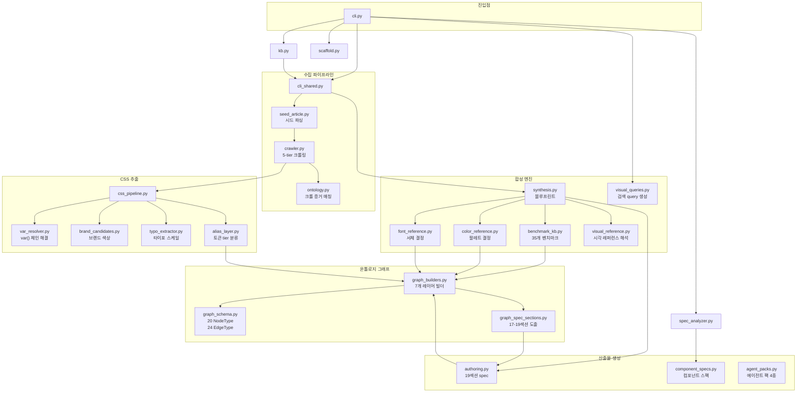

# Design Ontology Harness

다른 회사의 디자인 시스템을 참고해서, **우리 브랜드에 맞는 디자인 시스템 설계도**를 자동으로 만들고, 그 설계도를 기반으로 **AI가 만든 UI를 프로 수준으로 재구성**해주는 도구입니다.

> **그냥 프리셋을 쓰고 싶다면 →** [`design-ontology-plugin`](https://github.com/design-ontology/design-ontology-plugin) 레포로 가세요. 15종 프리셋 카탈로그 + `/design-start` 4단계 질문 UX + Next·raw-CSS 어댑터가 `/plugin install design-ontology` 한 줄로 설치됩니다.
>
> 이 harness 레포는 **프리셋 생성기**이자 **공급원**입니다. 프리셋을 새로 만들거나, 커스터마이징하거나, 내부적으로 KB·블루프린트 파이프라인을 돌리려는 고급 사용자·메인테이너를 위한 문서입니다.
>
> **피드백·이슈는 plugin 레포 이슈 트래커로** ([preset-feedback / new-preset / bug-report 템플릿](https://github.com/design-ontology/design-ontology-plugin/issues/new/choose)). 새 P3 프리셋 기여는 [`docs/CONTRIBUTING_PRESETS.md`](./docs/CONTRIBUTING_PRESETS.md).

## 플러그인 vs 하네스 — 언제 어느 쪽?

| 쓰려는 것 | 추천 경로 |
|-----------|-----------|
| 이미 있는 프리셋으로 빠르게 시작 | **plugin** (`/plugin install design-ontology`) |
| 자연어 / 4단계 질문으로 프리셋 고르기 | **plugin** (`/design-start`) |
| 새 브랜드 프로필로 프리셋 처음부터 합성 | **harness** (`run-project`) |
| 기존 프리셋을 복사해 커스터마이징 | **harness** (`customize-preset`) → `run-project` |
| 프리셋 산출물을 플러그인에 싱크 | **harness** (`scripts/sync-plugin-presets.sh`) |
| 공식 KB 크롤 + CSS 토큰 추출 | **harness** (`build-kb`) |

## 이 도구가 해결하는 문제

1. AI가 UI를 만들면 Tailwind 기본 색상 + shadow 떡칠 + 이모지 아이콘 → **어떤 제품이든 똑같이 생김**
2. 디자인 시스템을 만들고 싶은데 어디서 시작해야 할지 모름 → **설계서만 넣으면 자동 생성**
3. 색상, 서체를 어떻게 골라야 할지 모름 → **브랜드 키워드 기반으로 자동 결정**
4. 만들어진 스펙을 실제 코드에 적용하는 게 어려움 → **AI 에이전트가 자동 적용**

## 전체 워크플로우



## 핵심 개념

| 용어 | 의미 |
|------|------|
| **시드 URL** | 참고할 디자인 시스템의 웹 주소 (Carbon, Primer, GOV.UK 등) |
| **지식베이스(KB)** | 시드에서 수집한 정보를 정리한 저장소. 한 번 만들면 여러 프로젝트에서 재사용 |
| **브랜드 프로필** | 우리 제품의 정체성을 정의한 JSON (브랜드명, 키워드, 톤, 대상 사용자 등) |
| **시각 레퍼런스** | 로컬 스크린샷/레퍼런스 이미지를 분석해 visual motif, density, layout cue를 보강하는 입력 |
| **색상 레퍼런스** | 선택 가능한 색상 목록이 담긴 마크다운. 브랜드 키워드와 mood 매칭으로 팔레트를 자동 결정 |
| **서체 엔진** | 25+ 실무 서체 DB에서 브랜드/제품 유형에 맞는 서체 조합을 자동 선택 |
| **Rebuild** | 기존 화면의 기능은 보존하되, 디자인 시스템 기반으로 비주얼을 새로 구성하는 것 |

## 입력 구조: 공식 KB + Visual References

이 하네스는 입력을 두 층으로 나눠서 다룹니다.

- **구조적 truth source**: 공식 KB, `spec.md`, `brand_profile.json`, `color_reference`
- **시각 보조 입력**: `visual_reference`에 연결한 로컬 이미지, 스크린샷, 수집한 레퍼런스

중요한 원칙은 다음과 같습니다.

- 공식 KB와 spec은 컴포넌트 구조, 상태, 접근성, 토큰 정책의 근거입니다.
- visual reference는 density, surface language, corner bias, CTA prominence 같은 조형 힌트를 보강합니다.
- image-derived signal은 `observed`, `inferred`, `unverified` provenance 레벨을 함께 남깁니다.
- Pinterest는 필수 의존성이 아니라 **선택적 검색 보조 레이어**입니다. 직접 크롤링보다 검색어 생성과 사용자의 수동 수집을 우선합니다.
- Pinterest 보조 수집에서는 raw asset 다운로드보다 screenshot/reference URL 기록을 우선하고, 수집물이 재배포 가능한 에셋이라고 가정하지 않습니다.
- `system_spec.md`와 `component_specs.md`에서 image-derived hints는 advisory signal로만 취급됩니다.

## 빠른 시작

### 1단계: 설치

```bash
uv sync
```

### 2단계: 지식베이스 만들기

참고할 디자인 시스템 사이트들을 수집합니다. 한 번만 하면 됩니다.

```bash
uv run design-ontology build-kb \
  --kb-dir kb/default \
  --seed-url https://carbondesignsystem.com \
  --seed-url https://primer.style
```

바로 쓸 수 있는 공식 seed pack도 포함되어 있습니다.

- `seeds/professional-design-systems.txt`: 현재 크롤러로 바로 KB 빌드 가능한 공식 디자인 시스템 목록
- `seeds/browser-required-official-design-systems.txt`: 공식이지만 JS/접근 제약이 있어 브라우저 기반 수집기에 더 적합한 watchlist

현재 professional pack에는 **63개**의 공식 레퍼런스가 들어 있습니다:
Enterprise(Atlassian, Primer, Carbon, Fluent, Clarity, Workday Canvas, Wise 등), DevTools(Vercel Geist, shadcn/ui, Radix, Mantine, Chakra, Ant, Sentry, DigitalOcean 등), Consumer(Pinterest Gestalt, Uber Base, Grab 등), Government(GOV.UK, NHS, HMRC, DWP, Home Office, VA.gov, CMS, Canada, NSW, Ontario, Queensland, DTA Australia, BC, Singapore 등).
browser-required pack(27개)에는 Material Design 3, Apple HIG, Adobe Spectrum, Salesforce Lightning, Shopify Polaris, Airbnb DLS, Stripe Elements, Linear Method 등 JS 렌더링이 필요한 레퍼런스가 포함됩니다.

예:

```bash
uv run design-ontology build-kb \
  --kb-dir kb/professional \
  --seeds-file seeds/professional-design-systems.txt
```

설명은 [docs/SEED_PACKS.md](./docs/SEED_PACKS.md)에서 볼 수 있습니다.

### 3단계: 프로젝트 만들기

```bash
uv run design-ontology init \
  --project-dir projects/my-app \
  --brand-name "My App" \
  --product-summary "팀 협업을 위한 프로젝트 관리 도구"
```

생성된 `brand_profile.json`을 열어 브랜드 정보를 채워 넣으세요.

### 4단계: 로컬 시각 레퍼런스 연결

`brand_profile.json`의 `visual_reference.sources`에 로컬 이미지나 스크린샷 경로를 넣으면, 공식 KB와 별도로 visual direction을 분석할 수 있습니다.

```json
{
  "visual_reference": {
    "mode": "local-images",
    "query": [
      "editorial dashboard",
      "premium app UI"
    ],
    "sources": [
      "references/editorial-dashboard",
      "references/landing-hero-01.png"
    ],
    "preferred_count": 12,
    "extraction_policy": "advisory-only"
  }
}
```

원하면 설계서와 브랜드 프로필을 바탕으로 이미지 검색용 query set도 먼저 생성할 수 있습니다.

```bash
uv run design-ontology generate-visual-queries \
  --project-dir projects/my-app \
  --spec projects/my-app/spec.md \
  --sync-brand-profile
```

이 명령은 query set뿐 아니라 아래 보조 수집 산출물도 함께 생성합니다.

- `build/visuals/pinterest_assist_plan.json`
- `build/visuals/pinterest_candidate_manifest.json`
- `build/visuals/pinterest_selection_manifest.json`

로컬 이미지를 넣은 뒤에는 visual layer만 별도로 점검할 수도 있습니다.

```bash
uv run design-ontology analyze-visuals \
  --project-dir projects/my-app
```

이 단계는 선택 사항이지만, dashboard/landing처럼 조형 언어가 중요한 프로젝트에는 권장됩니다.

### 5단계: 설계서 작성

`projects/my-app/spec.md`에 제품의 화면 구성을 작성합니다.

```markdown
# My App 상세 설계서

## 메인 대시보드
- 좌측 사이드바 네비게이션
- 통계 카드로 주요 지표 표시
- 데이터 테이블로 목록 표시

## 설정 화면
- 프로필 편집 폼
- 알림 설정 (체크박스)
```

이 파일이 있으면 `run-project` 시 **필요한 UI 컴포넌트를 자동으로 탐지**합니다.

### 6단계: 설계도 생성

```bash
uv run design-ontology run-project \
  --project-dir projects/my-app \
  --kb-dir kb/default
```

### 결과 확인

`projects/my-app/build/system/` 아래에 생성됩니다.

| 파일 | 내용 |
|------|------|
| `blueprint/system_spec.md` | 디자인 원칙, 색상 팔레트, 서체 추천, 컴포넌트 정책 |
| `blueprint/token_schema.json` | 색상·여백·타이포 등 토큰 계층 구조 |
| `blueprint/component_inventory.json` | 컴포넌트 패밀리와 상태 정의 |
| `blueprint/system_ontology.json` | 20종 노드 × 24종 관계의 온톨로지 그래프 |
| `components/component_specs.md` | 컴포넌트별 상세 스펙 (구조, 상태, 토큰, 접근성, 브랜드 적용) |
| `components/component_specs.json` | 같은 내용의 JSON (에이전트용) |

## 설계서에서 컴포넌트 자동 탐지

설계서를 넣으면 어떤 컴포넌트가 필요한지 자동으로 파악합니다.

```bash
# 설계서만 분석
uv run design-ontology analyze-spec --spec-file spec.md

# 설계서 + KB + 브랜드 → 상세 컴포넌트 스펙 생성
uv run design-ontology build-components \
  --spec-file spec.md \
  --project-dir projects/my-app \
  --kb-dir kb/default
```

`analyze-spec` 결과 예시:

```
[analyze-spec] 15개 UI 패턴 감지:
  [15] forms:              폼, 양식, 드롭다운, 체크박스...
  [10] data tables:        테이블, 목록, 필터...
  [ 8] workspace navigation: 사이드바, 메뉴, 워크스페이스...
  [ 7] rich text editor:   에디터, 마크다운, 리치텍스트...
  ...
  총 64개 컴포넌트 도출
```

각 컴포넌트마다 아래 내용이 생성됩니다:

- **구조 (Anatomy)**: 필수 파트 목록 (container, label, icon 등)
- **상태 (States)**: default, hover, active, disabled, loading, error 등
- **토큰 바인딩**: surface, text, border, radius, padding, font 토큰 매핑
- **접근성**: role, aria, label, focus 관리 규칙
- **브랜드 적용**: 브랜드 키워드별 구체적 행동 지침
- **Visual adaptation hints**: 카드 elevation, border/fill, CTA prominence, filter/nav density, chart framing
- **레퍼런스 근거**: KB에서 매칭된 참고 자료 (BBC, Carbon 등)

## Visual Reference Quick Start

로컬 이미지 기반으로 바로 시작하는 가장 짧은 흐름입니다.

```bash
# 1) KB는 먼저 한 번 구축
uv run design-ontology build-kb --kb-dir kb/default --seeds-file seeds/professional-design-systems.txt

# 2) 프로젝트 생성
uv run design-ontology init --project-dir projects/my-app --brand-name "My App" --kb-dir ../../kb/default

# 3) brand_profile.json 에 visual_reference.sources 추가

# 4) 시각 분석만 먼저 확인
uv run design-ontology analyze-visuals --project-dir projects/my-app

# 5) 필요하면 검색 query 생성
uv run design-ontology generate-visual-queries --project-dir projects/my-app --spec projects/my-app/spec.md

# 6) 최종 산출물 생성
uv run design-ontology run-project --project-dir projects/my-app
```

생성되는 visual 산출물:

- `build/visuals/visual_reference_report.json`
- `build/visuals/visual_motifs.json`
- `build/visuals/layout_cues.json`
- `build/visuals/component_style_hints.json`
- `build/visuals/visual_query_suggestions.json`
- `build/visuals/pinterest_assist_plan.json`
- `build/visuals/pinterest_candidate_manifest.json`
- `build/visuals/pinterest_selection_manifest.json`

Pinterest-assisted 운영 상세는 [docs/PINTEREST_ASSISTED_WORKFLOW.md](./docs/PINTEREST_ASSISTED_WORKFLOW.md)에서 볼 수 있습니다.

## 색상 자동 결정

`brand_profile.json`에 `color_reference`를 설정하면, 색상 마크다운 문서에서 브랜드에 맞는 팔레트를 자동으로 골라줍니다.

```json
{
  "color_reference": {
    "path": "docs/color-reference.md",
    "preferred_families": ["Deep Reds", "Standard Oranges"],
    "palette_strategy": {
      "mode": "brand-guided",
      "temperature": "warm",
      "contrast": "balanced",
      "prefer_moods": ["세련됨", "신뢰감"],
      "avoid_moods": ["달콤함", "귀여움"]
    }
  }
}
```

**결정 과정:**
1. 브랜드 키워드(calm, editorial 등) → mood 신호 변환 (안정감, 고급스러움 등)
2. 색상 문서의 각 색상 mood와 매칭 → 점수 산출
3. primary / accent / surface_tint 역할 배정
4. semantic states (success, warning, danger, info)까지 자동 확장

## 서체 자동 결정

브랜드 프로필을 로드하면 서체도 자동으로 결정됩니다.

25+ 실무 서체 DB에서 선택:
- **Geometric Sans**: Inter, DM Sans, Plus Jakarta Sans, Space Grotesk
- **Humanist Sans**: Pretendard, Noto Sans, IBM Plex Sans, Wanted Sans
- **Serif Display**: Playfair Display, EB Garamond, Lora
- **Monospace**: JetBrains Mono, Fira Code, IBM Plex Mono

**결정 기준:**
- 브랜드 키워드 → 서체 성격 매칭 (editorial → serif heading, calm → humanist body)
- 제품 유형 자동 추론 → 서체 전략 (dashboard → tabular figures, editorial → serif+sans 대비)
- 한글 서체 자동 페어링 (Pretendard, Wanted Sans, Noto Sans KR 등)
- type scale 프리셋 (compact/default/editorial/display)

## AI 에이전트 연동

생성된 스펙을 구현 프로젝트에서 AI가 활용할 수 있도록 에이전트 팩을 설치합니다.

```bash
uv run design-ontology init-agent-pack \
  --target-repo /path/to/my-project \
  --targets claude
```

### 생성되는 스킬 4종

| 스킬 | 명령 | 용도 |
|------|------|------|
| **Rebuild** | `/design-rebuild` | 화면을 스펙 기반으로 **새로 구성**. 기능은 보존, 비주얼 전체 재설계. 드라마틱한 변화. |
| **Refactor** | `/design-refactor` | 기존 코드에 **토큰만 교체**. 레이아웃 안 깨짐. 안전한 점진 적용. |
| **Implement** | 자동 | 새 컴포넌트를 스펙에 맞게 구현 |
| **Architect** | 자동 | 토큰 구조, 롤아웃 순서 계획 |

### Rebuild vs Refactor

```
Rebuild:  기존 화면 분석 → 기능만 추출 → 스펙 기반으로 처음부터 다시 구성
          색상, 서체, 레이아웃, 여백, 컴포넌트 구조 모두 재설계
          → "다른 제품처럼" 보일 정도로 달라짐

Refactor: 기존 코드 유지 → color: #3b82f6 → color: var(--accent) 교체
          레이아웃, font-size, spacing 안 건드림
          → 겉보기엔 비슷하지만 토큰 체계가 잡힘
```

### Refactor 안전 규칙

- **font-size는 바꾸지 않음** — 기존 크기가 레이아웃에 맞춰져 있음. 토큰 스케일에 끼워 맞추면 줄바꿈이 깨짐.
- **spacing은 정확히 같은 값만 교체** — 14px을 16px 토큰으로 반올림하면 안 됨
- **레이아웃 속성 변경 금지** — display, width, height, position, flex-direction
- 확신 없으면 TODO 주석으로 남김

## CSS 추출 파이프라인

크롤링된 CSS에서 디자인 토큰을 자동으로 추출합니다.

```bash
# CSS 파일에서 직접 추출
uv run design-ontology extract-css --css-dir ./css --output-dir data

# 크롤링 시 자동 실행: HTML의 <link rel="stylesheet"> → 8개 병렬 다운로드 → 추출
```

**추출 항목:**
- **var_resolver**: CSS `var()` 체인 재귀 해결 + 순환 참조 감지
- **brand_candidates**: 시멘틱 변수 + selector 역할 + 빈도 기반 브랜드 색상 추출
- **typo_extractor**: 커스텀 프로퍼티에서 타이포그래피 스케일 자동 추출 (heading/text/display 분류)
- **alias_layer**: 시멘틱 토큰 tier 분류 (core → util → action → component)

## 5-tier Fallback 크롤링

JS 렌더링이나 접근 제한이 있는 사이트도 단계적으로 시도합니다.

```
Tier 1: httpx 기본 요청
Tier 2: Mobile UA (iPhone Safari)
Tier 3: Jina Reader (r.jina.ai)
Tier 4: Playwright (headless Chrome)
Tier 5: 중단 (에러 기록)
```

## 벤치마크 레퍼런스

35개 실서비스 디자인 시스템(Stripe, Vercel, Linear, Toss 등)의 특성 데이터를 내장하고 있습니다. 브랜드 키워드로 유사한 시스템을 찾을 수 있습니다.

```bash
# 키워드로 유사 시스템 검색
uv run design-ontology benchmark --keywords calm precise

# 전체 35개 시스템 목록
uv run design-ontology benchmark

# 브랜드 프로필 기반 자동 매칭 + 리포트 저장
uv run design-ontology benchmark --brand-profile brand_profile.json --output-dir data
```

합성 시 자동으로 매칭된 벤치마크 컨텍스트가 blueprint에 포함됩니다.

## 산출물 19섹션 구성

`system_spec.md`는 아래 19개 섹션으로 구성됩니다.

| 번호 | 섹션 | 내용 |
|------|------|------|
| 1 | Positioning | 브랜드, 제품, 대상, 플랫폼, 접근성 |
| 2 | Identity Guardrails | 키워드, 안티키워드, 톤, 시각/인터랙션 방향 |
| 3 | Design Principles | 브랜드 키워드 기반 원칙 |
| 4 | Foundation Priorities | 온톨로지에서 도출한 기초 우선순위 |
| 5 | Token Strategy | 토큰 계층, 타이포, 스페이싱, 서체 |
| 6 | Color Reference | 팔레트 결정, semantic role, 확장 |
| 7 | Component Strategy | 제품 primitive → 컴포넌트 패밀리 |
| 8 | Implementation Guardrails | 안전한 적용을 위한 규칙 |
| 9 | Reference Absorption Rule | 레퍼런스 활용 원칙 |
| 10 | AI Synthesis Principles | hex 미생성, 토큰명 미생성, 팩트 기반 해석 |
| 11 | Ontology Targets | 핵심 개념 신호 |
| 12 | Profile Validation | 프로필 검증 결과 |
| 13 | Quick Start | 시작 가이드, 적용 순서, 우선순위 |
| 14 | DO / DON'T | 브랜드 키워드 기반 구체적 규칙 |
| 15 | Drop-in CSS | 즉시 사용 가능한 `:root` CSS 변수 |
| 16 | CSS Extraction Summary | 크롤링 CSS 분석 결과 요약 |
| 17 | **Component-Token Map** | 컴포넌트별 사용 토큰 테이블 (그래프 기반) |
| 18 | **Contrast Audit** | surface/text 조합별 대비 비율 + AA/AAA 판정 |
| 19 | **Pattern Catalog** | 레이아웃/인터랙션 패턴 + 구성 컴포넌트 |

## 온톨로지 그래프

`system_ontology.json`은 단순 키워드 매칭이 아닌 **20종 노드 × 24종 관계**의 진짜 그래프입니다.

**노드 타입 (20종):**

| 카테고리 | 노드 |
|---------|------|
| 브랜드 | Brand, Principle |
| 컬러 | ColorPalette, ColorToken, ColorMode |
| 타이포 | FontFamily, TypeScaleEntry |
| 토큰 | SpacingToken, RadiusToken, MotionToken, ElevationToken |
| 컴포넌트 | ComponentFamily, Component, ComponentState |
| 패턴 | LayoutPattern, InteractionPattern |
| 기타 | AccessibilityRule, ProductPrimitive, SourceReference, BenchmarkSystem |

**엣지 타입 (24종):**

```
Brand ──expresses──▶ Principle ──constrains──▶ TokenCategory
Brand ──inspired_by──▶ BenchmarkSystem ──references_font──▶ FontFamily
ColorToken ──belongs_to_palette──▶ ColorPalette
ColorToken ──derived_from──▶ ColorToken (CSS var chain)
ColorToken ──contrast_pair──▶ ColorToken (WCAG ratio)
ColorToken ──overrides_in_mode──▶ ColorMode
FontFamily ──pairs_with──▶ FontFamily (heading↔body)
TypeScaleEntry ──uses_font──▶ FontFamily
Component ──member_of_family──▶ ComponentFamily
Component ──uses_token──▶ ColorToken
Component ──implements──▶ InteractionPattern
LayoutPattern ──composed_of──▶ Component
ComponentFamily ──requires──▶ AccessibilityRule
BenchmarkSystem ──similar_to──▶ BenchmarkSystem (Jaccard)
...
```

**그래프 쿼리:**

```python
from design_ontology_harness.graph_schema import DesignOntologyGraph, NodeType, EdgeType

graph = build_full_ontology_graph(brand_profile, blueprint, component_inventory, token_schema)

# 특정 타입의 모든 노드
colors = graph.get_nodes_by_type(NodeType.ColorToken)

# 특정 노드에서 나가는 엣지
edges = graph.get_edges_from("brand:my-app", EdgeType.expresses)

# 이웃 노드 탐색
neighbors = graph.get_neighbors("component:primary-button")
```

## CLI 명령어 전체 목록

| 명령어 | 용도 | 핵심 옵션 |
|--------|------|-----------|
| `build-kb` | 지식베이스 만들기 | `--kb-dir`, `--seed-url`, `--seeds-file` |
| `init` | 프로젝트 초기화 | `--project-dir`, `--brand-name` |
| `analyze-visuals` | 로컬 visual reference 단독 분석 | `--project-dir` or `--brand-profile` |
| `generate-visual-queries` | 이미지 검색용 query 생성 | `--project-dir` or `--brand-profile`, `--spec`, `--sync-brand-profile` |
| `run-project` | 설계도 + 컴포넌트 스펙 생성 | `--project-dir`, `--kb-dir` |
| `analyze-spec` | 설계서에서 UI 패턴 자동 탐지 | `--spec-file`, `--project-dir` |
| `build-components` | 상세 컴포넌트 스펙 생성 | `--spec-file`, `--project-dir`, `--kb-dir` |
| `extract-css` | CSS에서 디자인 토큰 추출 | `--css-dir`, `--html-file` |
| `benchmark` | 벤치마크 레퍼런스 검색 | `--keywords`, `--brand-profile` |
| `run` | KB 없이 한번에 실행 | `--seed-url`, `--brand-profile` |
| `synthesize` | 기존 크롤 결과로 재생성 | `--output-dir`, `--brand-profile` |
| `extract-seed` | 시드에서 링크만 추출 | `--seed-url` |
| `init-agent-pack` | AI 에이전트 팩 생성 | `--target-repo`, `--targets` |

## 데이터 흐름 상세



## 모듈 구조



## 플러그인 배포 (Phase 7~14)

이 harness 는 15종 프리셋을 찍어 [`design-ontology-plugin`](https://github.com/design-ontology/design-ontology-plugin) 공개 레포로 자동 싱크합니다. 최종 사용자는 `/plugin install design-ontology` 한 줄로 프리셋·스킬·에이전트·어댑터를 얻습니다.

> **Pretendard 서체 / SIL OFL 1.1** — 플러그인은 Pretendard Variable 을 **런타임 fetch** 방식으로 주입합니다 (`scripts/fetch-pretendard.mjs`). woff2 바이너리는 harness/plugin 레포 어디에도 번들되지 않고, OFL 고지(`LICENSE-FONTS`) 와 함께 설치 시점에 다운로드됩니다. 재배포 시 이 고지를 유지해야 합니다 (OFL §2).

### 프리셋 카탈로그 요약 (2026-04-20 현재 15종)

자동 생성된 카드 + 축 매트릭스 + Core HEX 스와치는 [`design-ontology-plugin/docs/CATALOG.md`](https://github.com/design-ontology/design-ontology-plugin/blob/main/docs/CATALOG.md) 에서 확인하세요. Harness 쪽에서는 `python3 scripts/build-catalog.py --output <path>` 로 언제든 재생성.

axis matrix (app_mode × brand_tone):

| app_mode \ brand_tone | minimal-tech | editorial-warm | bold-confident | playful-soft | corporate-trust |
|---|---|---|---|---|---|
| **dashboard** | `P0` orbit | `P2` curator | — | — | `P1` ledger |
| **document-content** | `P1` lattice | `P0` signal-desk | `P2` broadside | — | — |
| **marketing-landing** | `P2` beacon | — | `P0` premier-league | — | — |
| **commerce** | — | `P0` colorfit | `P2` drop | — | — |
| **conversation-copilot** | `P0` glacier | `P2` quill | — | — | — |
| **canvas-tool** | `P1` atelier | — | — | — | — |
| **community-feed** | — | — | — | `P1` bloom | — |
| **monitoring-ops** | `P1` pulse | — | — | — | — |

- P0 5종: MVP 승격 (기존 4프로젝트 + 신규 `dashboard--minimal-tech`)
- P1 5종: fintech · observability · reference-docs · social · canvas
- P2 5종: 톤 다변화 (각 app_mode 두번째/세번째 tone)
- P3: 커뮤니티 기여 + 실수요 검증 후 확장 (Phase 13-11 ~ 13-12)

### 고급 사용자 / 메인테이너 워크플로우

```bash
# 1. 새 프리셋 합성
uv run design-ontology run-project --project-dir projects/<new-project>
uv run design-ontology build-preset \
  --project projects/<new-project> \
  --preset-id <app_mode>--<brand_tone> \
  --owner maintainer --tier P2 \
  --color-modes light,dark --default-color-mode light \
  --tags <ko,saas,...>

# 2. 전체 재빌드 + 검증
uv run design-ontology rebuild-all-presets --projects-root projects
uv run design-ontology validate-presets
uv run design-ontology lint-previews

# 3. 카탈로그 재생성
python3 scripts/build-catalog.py \
  --output /path/to/design-ontology-plugin/docs/CATALOG.md

# 4. 플러그인 레포로 싱크 (compatibility 게이트 자동)
./scripts/sync-plugin-presets.sh \
  --plugin-repo /path/to/design-ontology-plugin

# 5. 기존 프리셋을 복사해 커스터마이징
uv run design-ontology customize-preset \
  --preset-id dashboard--minimal-tech \
  --project-name my-dashboard
# projects/my-dashboard/brand_profile.json 편집 후 run-project
```

### 버전 계약 (4필드 + compatibility.json)

프리셋 `manifest.json` 은 네 개의 1급 버전 필드를 가집니다:

| 필드 | 의미 | 변경 트리거 |
|------|------|-------------|
| `schema_version` | 산출물 내부 스키마 (token_schema 등) | 산출물 구조 변경 |
| `preset_api_version` | 플러그인 소비 계약 | manifest 필드 추가/삭제 |
| `generated_by_harness_version` | 생성 시점 Python 코어 버전 | 매 빌드 |
| `preview_version` | 프리뷰 아티팩트 포맷 | 텍스트/스크린샷 포맷 변경 |

`presets/compatibility.json` 은 이 harness 가 찍는 `current_preset_api_version` 과 지원 range (`supported_preset_api_range`) + 어댑터 호환 range 를 기록합니다. 플러그인 `plugin.json` 의 `supported_preset_api` 와 교차 검증하는 sync 게이트는 `scripts/check-plugin-compatibility.py` 에 있습니다. 자세한 계약 구조는 [`docs/PLUGIN_PLAN.md`](docs/PLUGIN_PLAN.md) §3.3 참고.

### Sync 파이프라인

```
harness presets/  ──(check-plugin-compatibility.py)──▶  plugin/presets/
           │                     │
           │                     └──(sync-plugin-presets.sh)── rsync + gh pr create
           │
           └──(.github/workflows/sync-plugin.yml)── main push 시 자동
```

- `scripts/sync-plugin-presets.sh --plugin-repo <path> [--dry-run]` — 로컬에서 수동 싱크
- `.github/workflows/sync-plugin.yml` — main push 시 compatibility 통과 시에만 PR 자동 생성 (`PLUGIN_REPO_TOKEN` 필요)
- `.github/workflows/validate.yml` (플러그인 쪽) — PR 수신 시 2차 compatibility 검증

## Phase 진행 상태

| Phase | 상태 | 산출물 |
|-------|------|--------|
| 1~6 | done | harness 코어 (KB · synthesis · graph · agent-pack) |
| 7 | done | 프리셋 인프라 + 버전 계약 4필드 + sync validator |
| 8 | done | P0 5종 프리셋 승격 + 텍스트 프리뷰 |
| 9 | done (로컬 scaffold) | 플러그인 레포 분리 + skills/agents 이식 |
| 10A | done | `nextjs-tailwind-shadcn` 어댑터 |
| 10B | done | `raw-css-variables` 어댑터 + `design_system_mirror_ops` 공통화 |
| 10C | done | `vite-tailwind` 어댑터 + base.py 승격 |
| 11 | done | MVP alpha — `/design-start` + matcher + installer |
| 12A | done | 텍스트 프리뷰 + preview_linter (E001–E008 / W001–W003) |
| 12B | deferred | P0 선택적 스크린샷 (alpha 후) |
| 13-1 ~ 13-10 | done | P1 + P2 누적 15종 |
| 13-11 ~ 13-12 | pending | P3 커뮤니티 기여 경로 |
| **14** | **in progress** | 공개 배포 — plugin/harness README · CATALOG · marketplace alpha 승격 · release 자동화 |
| 15 | pending | 라이프사이클 정책 운영 (catalog-health · promote · deprecate) |

## 예제 프로젝트

| 프로젝트 | 브랜드 키워드 | 자동 결정된 팔레트 | 자동 결정된 서체 |
|---------|------------|-----------------|---------------|
| `projects/signal-desk` | calm, precise, editorial, trustworthy | Charcoal + Burnt Sienna + Shell Pink | Lora(heading) + Pretendard(body) |
| `projects/premier-league` | bold, precise, energetic | Matchday Red + Electric Green + Golden Score | Plus Jakarta Sans(heading/body) |

## 폴더 구조

```
design_ontology_harness/   코어 프레임워크
  cli.py                   CLI 명령어 분기
  crawler.py               5-tier fallback 크롤링 + CSS 병렬 다운로드
  css_pipeline.py          CSS 추출 파이프라인 (var/brand/typo/alias 통합)
  var_resolver.py          CSS var() 체인 재귀 해결
  brand_candidates.py      브랜드 색상 후보 추출
  typo_extractor.py        타이포그래피 스케일 추출
  alias_layer.py           시멘틱 토큰 tier 분류
  synthesis.py             블루프린트 합성
  authoring.py             19섹션 산출물 생성
  graph_schema.py          온톨로지 그래프 스키마 (20 NodeType, 24 EdgeType)
  graph_builders.py        그래프 빌더 (brand/foundation/color/typo/pattern/a11y/benchmark)
  graph_spec_sections.py   그래프 기반 spec 섹션 생성 (17-19)
  benchmark_kb.py          35개 실서비스 벤치마크 KB
  color_reference.py       색상 팔레트 자동 결정
  font_reference.py        서체 자동 결정 (25+ 실무 서체 DB)
  spec_analyzer.py         설계서 → UI 패턴 탐지
  component_specs.py       컴포넌트별 상세 스펙 생성
  agent_packs.py           AI 에이전트 스킬 생성 (4종)
  ontology.py              크롤 증거 기반 개념 매칭 (문서→개념)
schemas/                   입력 스키마
config/                    브랜드 프로필 예시
docs/                      설계 문서
kb/                        지식베이스 (로컬 생성, gitignore)
projects/                  프로젝트 워크스페이스
```

## 참고

- 크롤링은 5-tier fallback 체인으로 대부분의 사이트를 수집합니다. Playwright tier를 사용하려면 `pip install playwright && playwright install chromium`이 필요합니다.
- 크롤링 시 CSS를 자동으로 병렬 다운로드하고 추출 파이프라인을 실행합니다.
- 온톨로지는 2-tier: `ontology.py`(크롤 증거 키워드 매칭) + `graph_builders.py`(20종 노드 관계 그래프). 그래프는 컬러↔컴포넌트↔패턴을 유기적으로 연결합니다.
- `config/brand_profile.example.json`을 참고해 브랜드 프로필을 작성하세요.
- 서체 결정은 Google Fonts/GitHub에서 무료로 사용 가능한 서체만 추천합니다.
- 벤치마크 KB의 35개 시스템은 합성 품질 비교와 키워드 매칭에 활용됩니다.

## 라이선스

MIT. `LICENSE` 파일 참조.
