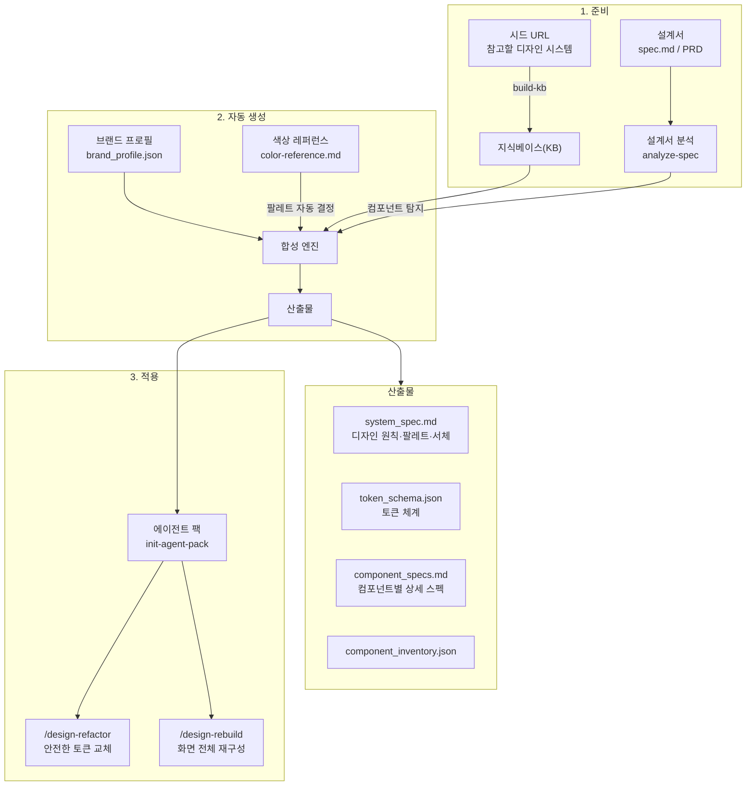
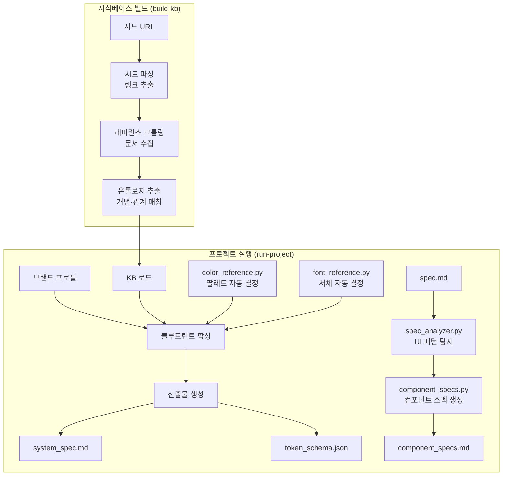
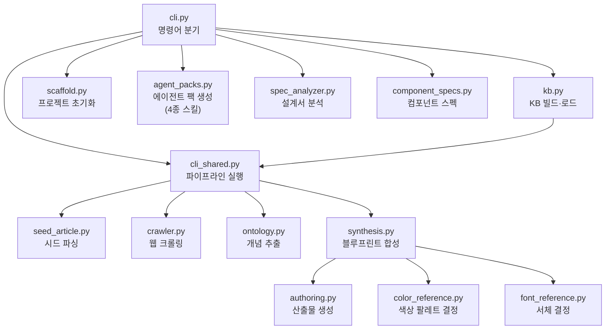

# Design Ontology Harness

다른 회사의 디자인 시스템을 참고해서, **우리 브랜드에 맞는 디자인 시스템 설계도**를 자동으로 만들고, 그 설계도를 기반으로 **AI가 만든 UI를 프로 수준으로 재구성**해주는 도구입니다.

## 이 도구가 해결하는 문제

1. AI가 UI를 만들면 Tailwind 기본 색상 + shadow 떡칠 + 이모지 아이콘 → **어떤 제품이든 똑같이 생김**
2. 디자인 시스템을 만들고 싶은데 어디서 시작해야 할지 모름 → **설계서만 넣으면 자동 생성**
3. 색상, 서체를 어떻게 골라야 할지 모름 → **브랜드 키워드 기반으로 자동 결정**
4. 만들어진 스펙을 실제 코드에 적용하는 게 어려움 → **AI 에이전트가 자동 적용**

## 전체 워크플로우



## 핵심 개념

| 용어 | 의미 |
|------|------|
| **시드 URL** | 참고할 디자인 시스템의 웹 주소 (Carbon, Primer, GOV.UK 등) |
| **지식베이스(KB)** | 시드에서 수집한 정보를 정리한 저장소. 한 번 만들면 여러 프로젝트에서 재사용 |
| **브랜드 프로필** | 우리 제품의 정체성을 정의한 JSON (브랜드명, 키워드, 톤, 대상 사용자 등) |
| **색상 레퍼런스** | 선택 가능한 색상 목록이 담긴 마크다운. 브랜드 키워드와 mood 매칭으로 팔레트를 자동 결정 |
| **서체 엔진** | 25+ 실무 서체 DB에서 브랜드/제품 유형에 맞는 서체 조합을 자동 선택 |
| **Rebuild** | 기존 화면의 기능은 보존하되, 디자인 시스템 기반으로 비주얼을 새로 구성하는 것 |

## 빠른 시작

### 1단계: 설치

```bash
uv sync
```

### 2단계: 지식베이스 만들기

참고할 디자인 시스템 사이트들을 수집합니다. 한 번만 하면 됩니다.

```bash
uv run design-ontology build-kb \
  --kb-dir kb/default \
  --seed-url https://carbondesignsystem.com \
  --seed-url https://primer.style
```

### 3단계: 프로젝트 만들기

```bash
uv run design-ontology init \
  --project-dir projects/my-app \
  --brand-name "My App" \
  --product-summary "팀 협업을 위한 프로젝트 관리 도구"
```

생성된 `brand_profile.json`을 열어 브랜드 정보를 채워 넣으세요.

### 4단계: 설계서 작성

`projects/my-app/spec.md`에 제품의 화면 구성을 작성합니다.

```markdown
# My App 상세 설계서

## 메인 대시보드
- 좌측 사이드바 네비게이션
- 통계 카드로 주요 지표 표시
- 데이터 테이블로 목록 표시

## 설정 화면
- 프로필 편집 폼
- 알림 설정 (체크박스)
```

이 파일이 있으면 `run-project` 시 **필요한 UI 컴포넌트를 자동으로 탐지**합니다.

### 5단계: 설계도 생성

```bash
uv run design-ontology run-project \
  --project-dir projects/my-app \
  --kb-dir kb/default
```

### 결과 확인

`projects/my-app/build/system/` 아래에 생성됩니다.

| 파일 | 내용 |
|------|------|
| `blueprint/system_spec.md` | 디자인 원칙, 색상 팔레트, 서체 추천, 컴포넌트 정책 |
| `blueprint/token_schema.json` | 색상·여백·타이포 등 토큰 계층 구조 |
| `blueprint/component_inventory.json` | 컴포넌트 패밀리와 상태 정의 |
| `blueprint/system_ontology.json` | 브랜드→원칙→토큰→컴포넌트 관계 그래프 |
| `components/component_specs.md` | 컴포넌트별 상세 스펙 (구조, 상태, 토큰, 접근성, 브랜드 적용) |
| `components/component_specs.json` | 같은 내용의 JSON (에이전트용) |

## 설계서에서 컴포넌트 자동 탐지

설계서를 넣으면 어떤 컴포넌트가 필요한지 자동으로 파악합니다.

```bash
# 설계서만 분석
uv run design-ontology analyze-spec --spec-file spec.md

# 설계서 + KB + 브랜드 → 상세 컴포넌트 스펙 생성
uv run design-ontology build-components \
  --spec-file spec.md \
  --project-dir projects/my-app \
  --kb-dir kb/default
```

`analyze-spec` 결과 예시:

```
[analyze-spec] 15개 UI 패턴 감지:
  [15] forms:              폼, 양식, 드롭다운, 체크박스...
  [10] data tables:        테이블, 목록, 필터...
  [ 8] workspace navigation: 사이드바, 메뉴, 워크스페이스...
  [ 7] rich text editor:   에디터, 마크다운, 리치텍스트...
  ...
  총 64개 컴포넌트 도출
```

각 컴포넌트마다 아래 내용이 생성됩니다:

- **구조 (Anatomy)**: 필수 파트 목록 (container, label, icon 등)
- **상태 (States)**: default, hover, active, disabled, loading, error 등
- **토큰 바인딩**: surface, text, border, radius, padding, font 토큰 매핑
- **접근성**: role, aria, label, focus 관리 규칙
- **브랜드 적용**: 브랜드 키워드별 구체적 행동 지침
- **레퍼런스 근거**: KB에서 매칭된 참고 자료 (BBC, Carbon 등)

## 색상 자동 결정

`brand_profile.json`에 `color_reference`를 설정하면, 색상 마크다운 문서에서 브랜드에 맞는 팔레트를 자동으로 골라줍니다.

```json
{
  "color_reference": {
    "path": "docs/color-reference.md",
    "preferred_families": ["Deep Reds", "Standard Oranges"],
    "palette_strategy": {
      "mode": "brand-guided",
      "temperature": "warm",
      "contrast": "balanced",
      "prefer_moods": ["세련됨", "신뢰감"],
      "avoid_moods": ["달콤함", "귀여움"]
    }
  }
}
```

**결정 과정:**
1. 브랜드 키워드(calm, editorial 등) → mood 신호 변환 (안정감, 고급스러움 등)
2. 색상 문서의 각 색상 mood와 매칭 → 점수 산출
3. primary / accent / surface_tint 역할 배정
4. semantic states (success, warning, danger, info)까지 자동 확장

## 서체 자동 결정

브랜드 프로필을 로드하면 서체도 자동으로 결정됩니다.

25+ 실무 서체 DB에서 선택:
- **Geometric Sans**: Inter, DM Sans, Plus Jakarta Sans, Space Grotesk
- **Humanist Sans**: Pretendard, Noto Sans, IBM Plex Sans, Wanted Sans
- **Serif Display**: Playfair Display, EB Garamond, Lora
- **Monospace**: JetBrains Mono, Fira Code, IBM Plex Mono

**결정 기준:**
- 브랜드 키워드 → 서체 성격 매칭 (editorial → serif heading, calm → humanist body)
- 제품 유형 자동 추론 → 서체 전략 (dashboard → tabular figures, editorial → serif+sans 대비)
- 한글 서체 자동 페어링 (Pretendard, Wanted Sans, Noto Sans KR 등)
- type scale 프리셋 (compact/default/editorial/display)

## AI 에이전트 연동

생성된 스펙을 구현 프로젝트에서 AI가 활용할 수 있도록 에이전트 팩을 설치합니다.

```bash
uv run design-ontology init-agent-pack \
  --target-repo /path/to/my-project \
  --targets claude
```

### 생성되는 스킬 4종

| 스킬 | 명령 | 용도 |
|------|------|------|
| **Rebuild** | `/design-rebuild` | 화면을 스펙 기반으로 **새로 구성**. 기능은 보존, 비주얼 전체 재설계. 드라마틱한 변화. |
| **Refactor** | `/design-refactor` | 기존 코드에 **토큰만 교체**. 레이아웃 안 깨짐. 안전한 점진 적용. |
| **Implement** | 자동 | 새 컴포넌트를 스펙에 맞게 구현 |
| **Architect** | 자동 | 토큰 구조, 롤아웃 순서 계획 |

### Rebuild vs Refactor

```
Rebuild:  기존 화면 분석 → 기능만 추출 → 스펙 기반으로 처음부터 다시 구성
          색상, 서체, 레이아웃, 여백, 컴포넌트 구조 모두 재설계
          → "다른 제품처럼" 보일 정도로 달라짐

Refactor: 기존 코드 유지 → color: #3b82f6 → color: var(--accent) 교체
          레이아웃, font-size, spacing 안 건드림
          → 겉보기엔 비슷하지만 토큰 체계가 잡힘
```

### Refactor 안전 규칙

- **font-size는 바꾸지 않음** — 기존 크기가 레이아웃에 맞춰져 있음. 토큰 스케일에 끼워 맞추면 줄바꿈이 깨짐.
- **spacing은 정확히 같은 값만 교체** — 14px을 16px 토큰으로 반올림하면 안 됨
- **레이아웃 속성 변경 금지** — display, width, height, position, flex-direction
- 확신 없으면 TODO 주석으로 남김

## CLI 명령어 전체 목록

| 명령어 | 용도 | 핵심 옵션 |
|--------|------|-----------|
| `build-kb` | 지식베이스 만들기 | `--kb-dir`, `--seed-url`, `--seeds-file` |
| `init` | 프로젝트 초기화 | `--project-dir`, `--brand-name` |
| `run-project` | 설계도 + 컴포넌트 스펙 생성 | `--project-dir`, `--kb-dir` |
| `analyze-spec` | 설계서에서 UI 패턴 자동 탐지 | `--spec-file`, `--project-dir` |
| `build-components` | 상세 컴포넌트 스펙 생성 | `--spec-file`, `--project-dir`, `--kb-dir` |
| `run` | KB 없이 한번에 실행 | `--seed-url`, `--brand-profile` |
| `synthesize` | 기존 크롤 결과로 재생성 | `--output-dir`, `--brand-profile` |
| `extract-seed` | 시드에서 링크만 추출 | `--seed-url` |
| `init-agent-pack` | AI 에이전트 팩 생성 | `--target-repo`, `--targets` |

## 데이터 흐름 상세



## 모듈 구조



## 예제 프로젝트

| 프로젝트 | 브랜드 키워드 | 자동 결정된 팔레트 | 자동 결정된 서체 |
|---------|------------|-----------------|---------------|
| `projects/signal-desk` | calm, precise, editorial, trustworthy | Charcoal + Burnt Sienna + Shell Pink | Lora(heading) + Pretendard(body) |
| `projects/premier-league` | bold, precise, energetic | Matchday Red + Electric Green + Golden Score | Plus Jakarta Sans(heading/body) |

## 폴더 구조

```
design_ontology_harness/   코어 프레임워크
  cli.py                   CLI 명령어 분기
  spec_analyzer.py         설계서 → UI 패턴 탐지
  component_specs.py       컴포넌트별 상세 스펙 생성
  color_reference.py       색상 팔레트 자동 결정
  font_reference.py        서체 자동 결정 (25+ 실무 서체 DB)
  synthesis.py             블루프린트 합성
  authoring.py             산출물 생성
  agent_packs.py           AI 에이전트 스킬 생성 (4종)
  crawler.py               웹 크롤링
  ontology.py              개념 추출
schemas/                   입력 스키마
config/                    브랜드 프로필 예시
docs/                      설계 문서
kb/                        지식베이스 (로컬 생성, gitignore)
projects/                  프로젝트 워크스페이스
```

## 참고

- 일부 외부 사이트는 접근 제한이나 JS 렌더링 의존으로 크롤링에 실패할 수 있습니다. 실패 내역은 CLI에 요약 출력됩니다.
- 온톨로지 추출은 현재 규칙 기반입니다. LLM 기반 확장을 위한 구조가 준비되어 있습니다.
- `config/brand_profile.example.json`을 참고해 브랜드 프로필을 작성하세요.
- 서체 결정은 Google Fonts/GitHub에서 무료로 사용 가능한 서체만 추천합니다.

## 라이선스

MIT. `LICENSE` 파일 참조.
