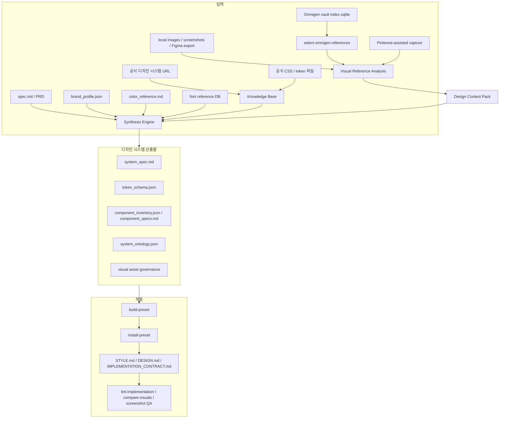
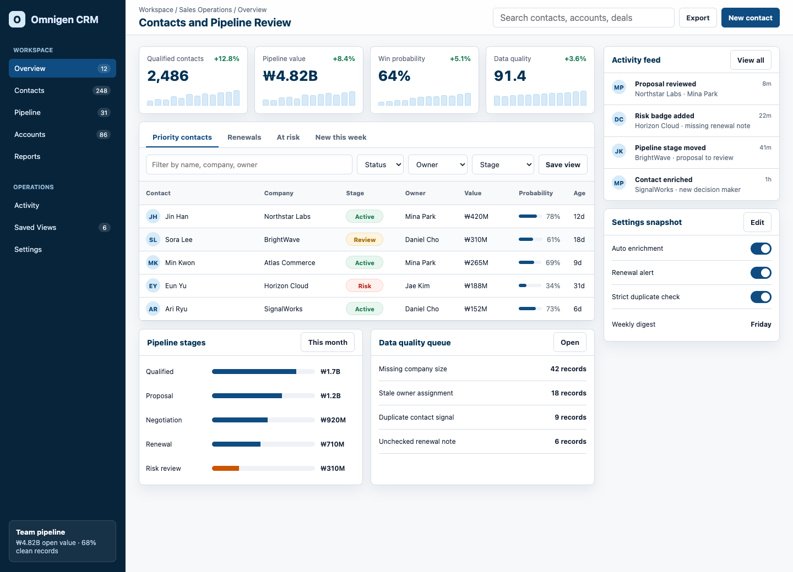

# Design Ontology Harness

`design-ontology-harness`는 디자인 시스템을 새로 만들거나, 기존 프리셋을 확장하거나, AI가 만든 화면을 더 제품답게 재구성하기 위한 **디자인 시스템 합성 하네스**입니다.

처음에는 공식 디자인 시스템 문서를 크롤링해 KB를 만들고, 브랜드 프로필과 설계서를 합성하는 도구였습니다. 지금은 여기에 **이미지 에셋 기반 레퍼런스 추출**이 붙었습니다. 즉, 공식 KB와 제품 브리프를 기본 진실 소스로 두면서도, 로컬 스크린샷, Figma export, Pinterest-assisted capture, Omnigen vault 같은 이미지 풀에서 화면 밀도, 레이아웃 리듬, 컴포넌트 형태, 표면 처리 힌트를 뽑아 디자인 시스템 산출물에 반영할 수 있습니다.

> 최종 사용자가 이미 만들어진 프리셋을 쓰는 목적이라면 [`design-ontology-plugin`](https://github.com/2000silpeed/design-ontology-plugin)을 쓰는 편이 빠릅니다. 이 레포는 프리셋을 만들고, 검증하고, 배포용 산출물로 승격시키는 공급원에 가깝습니다.

## 지금 할 수 있는 일

- 공식 디자인 시스템 사이트를 크롤링해 재사용 가능한 KB를 만든다.
- `brand_profile.json`과 `spec.md`를 읽어 제품 맞춤형 디자인 시스템 설계도를 만든다.
- 로컬 이미지, 스크린샷, Omnigen vault 이미지에서 visual motif와 layout cue를 추출한다.
- 이미지 레퍼런스를 색상/서체/IA의 진실 소스로 쓰지 않도록 권한 경계를 기록한다.
- `system_spec.md`, `token_schema.json`, `component_inventory.json`, `component_specs.md`, `system_ontology.json`을 생성한다.
- 생성된 시스템을 preset으로 승격하고, 구현 레포에 `STYLE.md`, `DESIGN.md`, CSS variables, 구현 계약서를 설치한다.
- 구현 결과를 lint, screenshot QA, visual comparison으로 점검한다.

## 최근 확장 요약

이번 README는 아래 변화까지 현재 기준으로 반영합니다.

| 변화 | 반영된 파일/명령 |
|---|---|
| 이미지 레퍼런스가 1차 입력 모델로 승격 | `brand_profile.visual_reference`, `analyze-visuals` |
| Omnigen vault에서 프로젝트별 UI 레퍼런스 선별 | `omnigen_references.py`, `select-omnigen-references` |
| Omnigen 외부 소스를 pack으로 묶는 범용 계층 추가 | `reference_packs.py`, `build-reference-pack`, `select-visual-references` |
| provider-neutral reference layer 추가 | `reference_context.py`, `design_context_pack.json` |
| 공개 웹페이지를 advisory reference로 정찰 | `website_inspection.py`, `inspect-reference-site` |
| Pinterest-assisted 검색/캡처/선택 흐름 추가 | `generate-visual-queries`, `capture-pinterest`, `select-pinterest-candidates` |
| 이미지 에셋 governance 확장 | `GeneratedVisualAsset`, `SourcedVisualAsset`, `LicensePolicy` |
| `system_spec.md` 후반 섹션 확장 | 22-26번 섹션 |
| ontology graph 확장 | 현재 34개 `NodeType`, 34개 `EdgeType` |
| 상업용 목업 완성도 규칙 추가 | Mockup Visual Substance, Commercial Product Realism |
| Omnigen CRM 샘플 프로젝트 추가 | `projects/omnigen-crm-demo` |
| 절차 설명 HTML과 사용설명서 추가 | `demo-report.html`, `USER_GUIDE.md` |

## Plugin vs Harness

| 목적 | 추천 경로 |
|---|---|
| 이미 있는 디자인 프리셋을 빠르게 적용 | `design-ontology-plugin` |
| `/design-start` 같은 질문형 UX로 프리셋 선택 | `design-ontology-plugin` |
| 새 브랜드와 제품 설계서로 디자인 시스템 합성 | 이 harness |
| 로컬 이미지/Omnigen vault를 레퍼런스로 연결 | 이 harness |
| 새 preset을 만들고 plugin 레포로 싱크 | 이 harness |
| KB, ontology, visual reference 파이프라인을 유지보수 | 이 harness |

## 전체 흐름



## 입력 권한 모델

이 하네스에서 가장 중요한 원칙은 “무엇을 어디까지 믿을 것인가”입니다. 이미지 레퍼런스가 들어와도 최종 시스템의 기준은 제품과 브랜드입니다.

| 입력 | 역할 | 권한 |
|---|---|---|
| `spec.md`, PRD | 제품 기능, 화면, 사용자 흐름 | 가장 높음 |
| `brand_profile.json` | 브랜드 정체성, 금지어, 플랫폼, 접근성 목표 | 가장 높음 |
| 공식 KB | 컴포넌트 구조, 상태, 접근성, 디자인 토큰 근거 | 높음 |
| `color_reference.md` | 팔레트 후보와 semantic color 검색 근거 | 높음 |
| font reference DB | 브랜드/제품 유형에 맞는 서체 후보 | 높음 |
| 로컬 이미지, screenshots, Omnigen | 밀도, 표면감, 컴포넌트 형태, 레이아웃 리듬 | 보조 |
| Pinterest/Lazyweb/Figma provider | 검색 후보, 비교 조사, export된 화면 맥락 | 보조 |

이미지 레퍼런스가 해도 되는 일:

- component morphology
- layout density
- panel/card proportion
- hierarchy rhythm
- interaction affordance pattern
- flow pattern label

이미지 레퍼런스가 하면 안 되는 일:

- 최종 color palette 결정
- typography scale 결정
- 제품 IA 결정
- product copy 복사
- 외부 이미지를 재배포 가능한 에셋처럼 취급
- 상표, 아이콘, 인물, 사진을 라이선스 없이 구현물에 복사

이 규칙은 `design_context_pack.json`, `system_spec.md`, `system_ontology.json`, `IMPLEMENTATION_CONTRACT.md`, `lint-implementation`에 반복해서 기록됩니다.

## 이미지 에셋 기반 추출

이미지 레이어는 “예쁜 분위기 참고”가 아니라, 산출물에 남는 구조화된 research layer입니다.

### 1. Omnigen vault 선별

`design_ontology_harness/omnigen_references.py`는 로컬 Omnigen vault의 `index.sqlite`를 읽고, 프로젝트 쿼리와 카테고리에 맞는 이미지를 소량만 고릅니다.

기본 vault 위치:

```text
~/.omnigen-vault
```

기본 검색 카테고리:

```text
web-design, app-design, mobile-design
```

선별 시 참고하는 값:

- `subject`, `style`, `palette`, `composition`, `mood`, `prompt`, `revised_prompt`
- `tags`, `rating`, `ocr_char_count`
- `width`, `height`, `orientation`
- `sha256`, `phash`, thumbnail path
- 프로젝트 query와 `brand_profile`의 제품/브랜드 키워드

선별 결과는 프로젝트 안에 metadata manifest로 남고, 이미지는 기본적으로 `build/visuals/omnigen-selected/`에 symlink됩니다. 그래서 하네스 본체나 public plugin 배포물에 이미지 원본이 섞이지 않습니다.

```bash
uv run design-ontology select-omnigen-references \
  --project-dir projects/my-app \
  --vault-dir ~/.omnigen-vault \
  --query "analytics dashboard crm contacts settings table" \
  --category app-design \
  --category web-design \
  --count 12 \
  --sync-sources
```

link mode는 세 가지입니다.

| mode | 의미 | 권장 상황 |
|---|---|---|
| `symlink` | `build/visuals/omnigen-selected/`에 링크만 생성 | 기본 개발 흐름 |
| `copy` | 선택 이미지를 build 안으로 복사 | vault 변경과 분리된 로컬 실험 |
| `absolute` | vault 원본 경로를 그대로 참조 | build 안에 파일을 만들고 싶지 않을 때 |

자세한 운영 규칙은 [docs/OMNIGEN_REFERENCE_PACKS.md](./docs/OMNIGEN_REFERENCE_PACKS.md)를 참고하세요.

### 2. Visual Reference Pack

Omnigen이 없어도 같은 경험을 만들 수 있습니다. 로컬 스크린샷 폴더, 웹 크롤링 결과, Lazyweb/Figma export, 별도 manifest를 `pack.json + assets.jsonl + index.sqlite` 형식으로 묶으면 됩니다.

```bash
uv run design-ontology build-reference-pack \
  --pack-id crm-web-research \
  --source-url https://example.com/case-study \
  --category web-reference \
  --tags "public-web,reference-only" \
  --materialize metadata
```

프로젝트에서 pack을 선택합니다.

```bash
uv run design-ontology select-visual-references \
  --project-dir projects/my-app \
  --pack crm-web-research \
  --query "crm analytics dashboard contacts table" \
  --count 12 \
  --sync-sources
```

선택 결과를 눈으로 검수하려면 HTML 갤러리를 뽑습니다.

```bash
uv run design-ontology export-reference-gallery \
  --pack crm-web-research \
  --selection projects/my-app/build/visuals/visual_reference_pack_selection.json \
  --output projects/my-app/reference-gallery.html
```

`metadata` pack은 원본 이미지를 복사하지 않고 URL과 메타데이터만 남깁니다. 실제 이미지 분석이 필요하면 local folder pack을 `--materialize copy`로 만들거나, 웹 이미지를 내부 용도로 `--materialize download`로 내려받으면 됩니다. 검색어와 같은 단어를 공통 `--tags`에 넣으면 모든 asset 점수가 비슷해지므로, 공통 tag는 `public-web`, `reference-only`처럼 중립적으로 두는 편이 좋습니다. 자세한 내용은 [docs/VISUAL_REFERENCE_PACKS.md](./docs/VISUAL_REFERENCE_PACKS.md)를 참고하세요.

### 2-1. Website Reference Inspection

공개 웹페이지의 섹션 구조, 화면 밀도, 상호작용 affordance를 참고하고 싶을 때는
`inspect-reference-site`로 research artifact를 만듭니다. 이 명령은 원본 사이트를
복제하기 위한 경로가 아니라, `Design Context Pack`에 넣을 수 있는 advisory reference를
만드는 경로입니다.

```bash
uv run design-ontology inspect-reference-site \
  --project-dir projects/my-app \
  --url https://example.com/product \
  --label "Example product page" \
  --sync-brand-profile
```

생성되는 `build/website_research/design_context_pack.json`은 형태, 밀도, hierarchy rhythm,
interaction model만 참고 신호로 제공합니다. 색상, 폰트, IA, 카피, 외부 이미지는 흡수하지
않습니다. 자세한 내용은 [docs/WEBSITE_REFERENCE_INSPECTION.md](./docs/WEBSITE_REFERENCE_INSPECTION.md)를 참고하세요.

### 3. Visual Reference 분석

`design_ontology_harness/visual_reference.py`는 `brand_profile.visual_reference.sources`에 연결된 이미지와 폴더를 분석합니다.

추출되는 대표 신호:

- 이미지 수, 선택 이미지 수, source coverage
- 파일 경로, provider, sha256, 크기, 비율
- density: `dense`, `balanced`, `airy`
- surface style: `flat`, `tinted`, `elevated` 등
- corner style, typography mood, color balance
- layout cue: dashboard grid, split-pane, table-heavy, card stack 등
- component style hint: cards, navigation, data display, forms, typography
- candidate component archetype
- reference mood summary

분석 명령:

```bash
uv run design-ontology analyze-visuals \
  --project-dir projects/my-app
```

생성 파일:

```text
projects/my-app/build/visuals/
  visual_reference_report.json
  visual_motifs.json
  layout_cues.json
  component_style_hints.json
  candidate_component_archetypes.json
  reference_mood_summary.json
  design_context_pack.json
```

### 4. Reference Intelligence Pack

`design_ontology_harness/reference_context.py`는 provider가 달라도 같은 구조로 reference context를 정리합니다.

지원하는 provider 모델:

- `local-images`
- `uploaded-screenshots`
- `pinterest`
- `lazyweb`
- `figma`
- `omnigen-vault` source entry

이 레이어의 핵심 산출물은 `design_context_pack.json`입니다. 여기에는 provider 상태, context card, flow index, morphology index, research gap, absorption policy가 들어갑니다.

## 빠른 시작

### 1. 설치

```bash
uv sync
```

### 2. KB 만들기

```bash
uv run design-ontology build-kb \
  --kb-dir kb/default \
  --seed-url https://carbondesignsystem.com \
  --seed-url https://primer.style
```

공식 seed pack을 써도 됩니다.

```bash
uv run design-ontology build-kb \
  --kb-dir kb/professional \
  --seeds-file seeds/professional-design-systems.txt
```

관련 문서:

- [docs/SEED_PACKS.md](./docs/SEED_PACKS.md)
- [docs/ARCHITECTURE.md](./docs/ARCHITECTURE.md)

### 3. 프로젝트 만들기

```bash
uv run design-ontology init \
  --project-dir projects/my-app \
  --brand-name "My App" \
  --product-summary "B2B 팀을 위한 운영 대시보드" \
  --kb-dir ../../kb/default
```

생성된 파일:

```text
projects/my-app/
  brand_profile.json
  spec.md
  project_manifest.json
  agent_brief.md
  seeds/seed_urls.txt
```

`brand_profile.json`에서 다음 값을 채우면 결과가 좋아집니다.

- `brand_keywords`
- `anti_keywords`
- `tone_of_voice`
- `visual_keywords`
- `interaction_keywords`
- `product_primitives`
- `accessibility_targets`
- `color_reference`
- `visual_reference`

### 4. 이미지 레퍼런스 연결

가장 단순한 로컬 이미지 설정:

```json
{
  "visual_reference": {
    "mode": "local-images",
    "query": [
      "dense analytics dashboard",
      "crm contacts table ui"
    ],
    "sources": [
      "references/visual",
      "references/dashboard-example.png"
    ],
    "preferred_count": 12,
    "extraction_policy": "advisory-only"
  }
}
```

Omnigen vault에서 바로 고르는 설정:

```bash
uv run design-ontology select-omnigen-references \
  --project-dir projects/my-app \
  --query "crm analytics dashboard contacts settings table kpi" \
  --category app-design \
  --category web-design \
  --count 12 \
  --sync-sources
```

Pinterest-assisted 검색 후보를 만들고 싶다면:

```bash
uv run design-ontology generate-visual-queries \
  --project-dir projects/my-app \
  --spec projects/my-app/spec.md \
  --sync-brand-profile
```

선택한 후보를 source로 승격:

```bash
uv run design-ontology select-pinterest-candidates \
  --project-dir projects/my-app \
  --candidate q03-c02 \
  --candidate q05-c01 \
  --sync-sources
```

### 5. Visual layer 점검

```bash
uv run design-ontology analyze-visuals \
  --project-dir projects/my-app
```

### 6. 디자인 시스템 합성

```bash
uv run design-ontology run-project \
  --project-dir projects/my-app
```

### 7. Preset으로 승격

```bash
uv run design-ontology build-preset \
  --project projects/my-app \
  --preset-id dashboard--operational \
  --owner your-handle \
  --tier P3 \
  --tags "dashboard,crm,ko"
```

### 8. 구현 레포에 설치

```bash
uv run design-ontology install-preset \
  --preset-id dashboard--operational \
  --target-repo /path/to/app \
  --adapter nextjs-tailwind-shadcn \
  --locale ko
```

설치 후 구현 레포에는 보통 아래 산출물이 들어갑니다.

```text
design-system/
  STYLE.md
  DESIGN.md
  IMPLEMENTATION_CONTRACT.md
  INSTALLED.json
  blueprint/
  components/
  ontology/
```

## 주요 산출물

| 경로 | 설명 |
|---|---|
| `build/visuals/omnigen_reference_selection.json` | Omnigen vault에서 고른 이미지 목록과 score, source metadata |
| `build/visuals/visual_reference_report.json` | 이미지 레퍼런스 전체 분석 보고서 |
| `build/visuals/visual_motifs.json` | density, surface, typography mood, color balance |
| `build/visuals/layout_cues.json` | 레이아웃 패턴 후보와 confidence |
| `build/visuals/component_style_hints.json` | 카드, 네비게이션, 데이터 표시 등 컴포넌트별 조형 힌트 |
| `build/visuals/design_context_pack.json` | provider-neutral reference intelligence |
| `build/system/blueprint/system_spec.md` | 사람이 읽는 디자인 시스템 설계서 |
| `build/system/blueprint/token_schema.json` | 색상, 서체, spacing, radius, motion, elevation token |
| `build/system/blueprint/component_inventory.json` | 구현해야 할 컴포넌트 목록과 역할 |
| `build/system/components/component_specs.md` | 컴포넌트 구조, 상태, 토큰 바인딩, 접근성 규칙 |
| `build/system/blueprint/system_ontology.json` | typed ontology graph |
| `build/system/blueprint/design_context_pack.json` | 합성된 시스템 쪽으로 복사된 reference intelligence |
| `build/system/blueprint/aesthetic_ontology.json` | aesthetic loop 평가 기준 |

`system_spec.md`는 현재 26개 섹션까지 생성됩니다. 특히 최근에 추가된 뒤쪽 섹션이 중요합니다.

| 섹션 | 의미 |
|---|---|
| 22. Brand Identity Assets | 앱 아이콘, 브랜드 식별 에셋, SVG/PNG medium override |
| 23. Generated Visual Asset Plan | AI 생성 이미지가 필요한 위치와 prompt/manifest 원칙 |
| 24. Mockup Visual Substance | 이미지 없는 목업을 미완성으로 보는 기준 |
| 25. Reference Intelligence Pack | provider, context card, 허용/금지 흡수 범위 |
| 26. Commercial Product Realism | 상업용 제품 목업의 현실감, 데이터/콘텐츠/에셋 완성도 |

`graph_schema.py` 기준 ontology graph는 현재 34개 `NodeType`, 34개 `EdgeType`을 갖습니다. 이미지 에셋과 reference intelligence 확장 때문에 `GeneratedVisualAsset`, `SourcedVisualAsset`, `VisualAssetProvider`, `LicensePolicy`, `ReferenceProvider`, `DesignContextPack`, `DesignContextCard`, `ImplementationFailurePattern` 같은 노드가 포함됩니다.

## 합성 엔진이 결정하는 것

이미지 레퍼런스가 들어와도 최종 디자인 시스템은 여러 레이어를 합쳐서 결정됩니다.

| 레이어 | 담당 모듈 | 결과 |
|---|---|---|
| 설계서 분석 | `spec_analyzer.py`, `component_specs.py` | 필요한 화면, 컴포넌트, 상태, product primitive |
| 색상 결정 | `color_reference.py`, `semantic_color_selector.py` | brand-guided palette, semantic roles, contrast pairs |
| 서체 결정 | `font_reference.py` | heading/body/UI/mono pairing, locale pairing |
| CSS 근거 | `css_pipeline.py`, `typo_extractor.py` | 공식 시스템의 변수, 브랜드 컬러, typography evidence |
| 컴포넌트 전략 | `advanced_components.py`, `component_specs.py` | component inventory, anatomy, states, token binding |
| 온톨로지 | `graph_schema.py`, `graph_builders.py` | token, component, pattern, asset, governance 관계 |
| 스타일 캡슐 | `style_capsule.py`, `agent_packs.py` | 구현 에이전트가 먼저 읽는 `STYLE.md`, `DESIGN.md` |
| 품질 게이트 | `implementation_linter.py`, `aesthetic_loop.py`, `visual_evidence.py` | token 위반, visual diff, aesthetic score 점검 |

색상은 매번 semantic color ontology와 브랜드 키워드를 함께 검색해서 고릅니다. 미리 정해 둔 palette preset을 그대로 끼우는 방식이 아니라, 제품 맥락과 `color_reference` 근거를 결합합니다.

서체는 제품 유형, 톤, 플랫폼, locale을 보고 고릅니다. 한국어 구현에는 locale pairing이 중요하므로, preset 설치 시 `--locale ko`를 함께 쓰는 흐름을 권장합니다.

## 구현과 검증

`install-preset` 이후 구현 레포에는 디자인 시스템 산출물과 실행 계약이 들어갑니다. 에이전트나 사람이 화면을 고칠 때는 이 계약이 외부 레퍼런스보다 우선합니다.

검증 흐름:

```bash
uv run design-ontology lint-implementation \
  --target-repo /path/to/app

uv run design-ontology compare-visuals \
  --before baseline.png \
  --after revised.png

uv run design-ontology aesthetic-loop \
  --project-dir projects/my-app \
  --candidate candidate.json
```

검증에서 보는 것:

- 하드코딩 색상/서체 대신 token을 쓰는지
- 외부 이미지 레퍼런스를 구현 에셋으로 잘못 복사하지 않았는지
- 작은 화면에서 버튼, 탭, 카드, 테이블 텍스트가 깨지지 않는지
- 이미지가 필요한 목업인데 빈 카드와 gradient placeholder만 남기지 않았는지
- generated/sourced asset manifest에 prompt, source, license, alt text가 남는지

## Omnigen CRM 데모

이번 확장을 검증하기 위해 `projects/omnigen-crm-demo` 샘플을 만들었습니다.

데모가 보여주는 것:

- `~/.omnigen-vault`에서 CRM/dashboard 관련 UI 이미지를 선별
- 선별 이미지를 `visual_reference.sources`에 동기화
- `analyze-visuals`로 dense dashboard, flat card, split-pane, data table cue 추출
- `run-project`로 디자인 시스템 산출물 생성
- 산출물을 바탕으로 인터랙티브 CRM 목업 작성
- 절차와 샘플 이미지를 HTML 설명 자료로 정리



주요 파일:

| 파일 | 설명 |
|---|---|
| [projects/omnigen-crm-demo/brand_profile.json](./projects/omnigen-crm-demo/brand_profile.json) | CRM 제품 브리프, visual_reference, Omnigen source |
| [projects/omnigen-crm-demo/spec.md](./projects/omnigen-crm-demo/spec.md) | 화면/기능 설계서 |
| [projects/omnigen-crm-demo/mockup/index.html](./projects/omnigen-crm-demo/mockup/index.html) | 인터랙티브 CRM 목업 |
| [projects/omnigen-crm-demo/demo-report.html](./projects/omnigen-crm-demo/demo-report.html) | 절차, 산출물, 샘플 이미지를 정리한 HTML 보고서 |
| [projects/omnigen-crm-demo/USER_GUIDE.md](./projects/omnigen-crm-demo/USER_GUIDE.md) | 목업 사용설명서 |

생성 후 확인할 경로:

```text
projects/omnigen-crm-demo/build/visuals/omnigen_reference_selection.json
projects/omnigen-crm-demo/build/visuals/visual_reference_report.json
projects/omnigen-crm-demo/build/system/blueprint/system_spec.md
```

데모를 로컬에서 열기:

```bash
python3 -m http.server 8765 --bind 127.0.0.1
```

```text
http://127.0.0.1:8765/projects/omnigen-crm-demo/mockup/index.html
http://127.0.0.1:8765/projects/omnigen-crm-demo/demo-report.html
```

목업에서 동작하는 기능:

- `New contact`: 테이블에 새 연락처 추가
- `Export`: 현재 필터 결과 CSV 저장
- 상단 검색: 연락처, 회사, 담당자, 상태 기준 필터
- `Status`, `Owner`, `Stage`: 테이블 조건 필터
- saved view tab: 보기 전환
- `Save view`: toast 표시
- Pipeline 기간 버튼: 범위 전환
- Data quality queue `Open`: 상세 행 토글
- Activity feed `View all`: 활동 목록 확장/접기
- Settings switch: 클릭 또는 키보드 토글
- 왼쪽 내비게이션: active 상태와 상단 제목 변경

## CLI 명령 요약

| 명령 | 용도 |
|---|---|
| `build-kb` | seed URL 또는 seed file에서 KB 생성 |
| `init` | harness project scaffold 생성 |
| `run-project` | KB, brand profile, spec, visual reference를 합성해 시스템 산출물 생성 |
| `analyze-spec` | 설계서에서 필요한 컴포넌트와 product primitive 탐지 |
| `analyze-visuals` | 로컬 이미지/스크린샷 기반 visual reference 분석 |
| `inspect-reference-site` | 공개 웹페이지를 advisory-only reference context로 정찰 |
| `generate-visual-queries` | 브랜드와 spec 기반 이미지 검색 query 생성 |
| `capture-pinterest` | Pinterest 검색 결과 tile을 로컬 후보로 캡처 |
| `select-pinterest-candidates` | 캡처 후보를 selection manifest에 고정 |
| `sync-pinterest-selection` | 선택된 Pinterest 후보를 `visual_reference.sources`에 반영 |
| `select-omnigen-references` | 로컬 Omnigen vault에서 프로젝트별 이미지 레퍼런스 선별 |
| `build-reference-pack` | 로컬 폴더, manifest, 웹 URL에서 Visual Reference Pack 생성 |
| `list-reference-packs` | 설치된 Visual Reference Pack 목록 확인 |
| `select-visual-references` | 범용 reference pack에서 프로젝트별 레퍼런스 선별 |
| `export-reference-gallery` | Pack과 selection manifest를 HTML 갤러리로 검수 |
| `extract-css` | CSS에서 토큰, 브랜드 컬러, typography 후보 추출 |
| `build-components` | spec, KB, brand profile 기반 컴포넌트 상세 스펙 생성 |
| `benchmark` | 브랜드 키워드와 맞는 참고 디자인 시스템 추천 |
| `build-preset` | 프로젝트 산출물을 `presets/<id>/`로 승격 |
| `install-preset` | preset을 구현 레포에 설치 |
| `match-preset` | 사용자 신호에 맞는 preset 추천 |
| `validate-presets` | preset 구조와 버전 계약 검증 |
| `lint-previews` | preset preview 문서 규칙 검사 |
| `lint-implementation` | 구현 레포에서 token binding, 금지 패턴 검사 |
| `compare-visuals` | before/after screenshot 변화량 검증 |
| `aesthetic-loop` | 디자인 후보의 aesthetic score 평가와 개선 action 생성 |
| `score-screenshot` | screenshot에서 aesthetic-loop 후보 metrics 생성 |
| `init-agent-pack` | 구현 레포용 agent instruction pack 생성 |
| `customize-preset` | 기존 preset을 프로젝트로 복사해 재합성 준비 |
| `rebuild-all-presets` | matrix 기반 전체 preset 재생성 |
| `catalog-health` | preset catalog 건강도와 drift 점검 |
| `promote-preset` | lifecycle gate 통과 후 preset tier 승격 |
| `deprecate-preset` | preset deprecated 처리 |
| `prune-preset` | 조건을 만족한 deprecated preset 제거 |
| `build-sources` | preset별 source metadata 생성 |

## 배포 전략

이미지 corpus는 무겁고, 저작권과 재배포 조건도 제각각입니다. 그래서 이 레포의 기본 원칙은 다음과 같습니다.

- harness에는 코드, 스키마, 문서, metadata, preset 산출물만 둔다.
- Omnigen 원본 이미지나 대형 스크린샷 묶음은 public package에 넣지 않는다.
- 프로젝트별로 필요한 이미지만 `build/visuals/` 아래에 symlink하거나 복사한다.
- `build/` 산출물은 로컬 실험 결과로 취급하고, 재현 가능한 manifest를 남긴다.
- reference-only 이미지는 구현 에셋으로 복사하지 않는다.
- 실제 제품에 들어갈 이미지는 `GeneratedVisualAsset` 또는 `SourcedVisualAsset`로 manifest와 license metadata를 갖춰야 한다.

이 방식이면 사용자는 가벼운 harness/plugin을 설치하고, 필요한 경우 자기 로컬 vault나 별도 reference pack을 연결할 수 있습니다.

## 코드 구조

```text
design_ontology_harness/
  cli.py                       CLI entry point
  scaffold.py                  project scaffold
  crawler.py                   공식 문서 수집
  kb.py                        KB 로드/저장
  css_pipeline.py              CSS token extraction
  color_reference.py           semantic color selection
  font_reference.py            font pairing
  visual_reference.py          local image reference analysis
  omnigen_references.py        Omnigen vault selection/sync
  visual_queries.py            image-search query generation
  pinterest_assist.py          Pinterest assist manifests
  pinterest_capture.py         Playwright capture support
  reference_context.py         Design Context Pack
  synthesis.py                 blueprint synthesis
  authoring.py                 system_spec/token/component 문서 생성
  graph_schema.py              typed ontology schema
  graph_builders.py            system ontology graph builder
  graph_spec_sections.py       graph-backed spec sections 18-26
  component_specs.py           detailed component spec builder
  preset_builder.py            project -> preset promotion
  preset_installer.py          preset -> implementation repo install
  implementation_linter.py     implementation contract lint
  aesthetic_loop.py            aesthetic scoring loop
  agent_packs.py               agent instructions
```

## 관련 문서

- [docs/OMNIGEN_REFERENCE_PACKS.md](./docs/OMNIGEN_REFERENCE_PACKS.md)
- [docs/VISUAL_REFERENCE_PACKS.md](./docs/VISUAL_REFERENCE_PACKS.md)
- [docs/REFERENCE_INTELLIGENCE.md](./docs/REFERENCE_INTELLIGENCE.md)
- [docs/PINTEREST_ASSISTED_WORKFLOW.md](./docs/PINTEREST_ASSISTED_WORKFLOW.md)
- [docs/VISUAL_REFERENCE_VALIDATION_REPORT.md](./docs/VISUAL_REFERENCE_VALIDATION_REPORT.md)
- [docs/AESTHETIC_SELF_IMPROVEMENT_LOOP.md](./docs/AESTHETIC_SELF_IMPROVEMENT_LOOP.md)
- [docs/IMPLEMENTATION_WORKFLOW.md](./docs/IMPLEMENTATION_WORKFLOW.md)
- [docs/CONTRIBUTING_PRESETS.md](./docs/CONTRIBUTING_PRESETS.md)
- [docs/PLUGIN_LOCAL_DEV.md](./docs/PLUGIN_LOCAL_DEV.md)

## 유지보수 메모

- README의 수치가 헷갈리면 `python3 -c "from design_ontology_harness.graph_schema import NodeType, EdgeType; print(len(NodeType), len(EdgeType))"`로 현재 graph schema를 확인하세요.
- 이미지 레퍼런스는 advisory-only가 기본입니다. 새로운 provider를 붙여도 `reference_context.REFERENCE_ABSORPTION_POLICY`의 allowed/denied 경계를 먼저 맞춰야 합니다.
- mockup이나 웹사이트 산출물을 만들 때는 의미 있는 visual asset이 필요한 도메인인지 먼저 판단하고, 필요한 경우 manifest와 license/prompt metadata를 남겨야 합니다.
- 구현 품질 검증은 `lint-implementation`, screenshot QA, `compare-visuals`를 함께 보는 흐름을 권장합니다.
