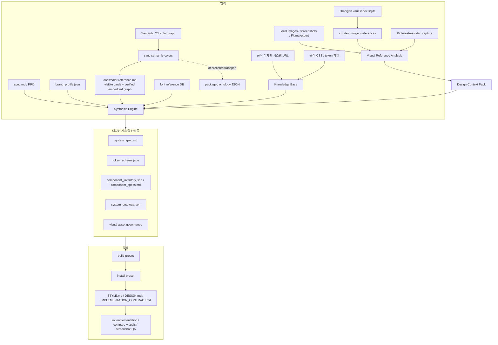

# Design Ontology Harness

`design-ontology-harness`는 디자인 시스템을 새로 만들거나, 기존 프리셋을 확장하거나, AI가 만든 화면을 더 제품답게 재구성하기 위한 **디자인 시스템 합성 하네스**입니다.

처음에는 공식 디자인 시스템 문서를 크롤링해 KB를 만들고, 브랜드 프로필과 설계서를 합성하는 도구였습니다. 지금은 여기에 **이미지 에셋 기반 레퍼런스 추출**이 붙었습니다. 즉, 공식 KB와 제품 브리프를 기본 진실 소스로 두면서도, 로컬 스크린샷, Figma export, Pinterest-assisted capture, Omnigen vault 같은 이미지 풀에서 화면 밀도, 레이아웃 리듬, 컴포넌트 형태, 표면 처리 힌트를 뽑아 디자인 시스템 산출물에 반영할 수 있습니다.

> 최종 사용자가 이미 만들어진 프리셋을 쓰는 목적이라면 [`design-ontology-plugin`](https://github.com/2000silpeed/design-ontology-plugin)을 쓰는 편이 빠릅니다. 이 레포는 프리셋을 만들고, 검증하고, 배포용 산출물로 승격시키는 공급원에 가깝습니다.

## 지금 할 수 있는 일

- 공식 디자인 시스템 사이트를 크롤링해 재사용 가능한 KB를 만든다.
- `brand_profile.json`과 `spec.md`를 읽어 제품 맞춤형 디자인 시스템 설계도를 만든다.
- 로컬 이미지, 스크린샷, Omnigen vault 이미지에서 visual motif와 layout cue를 추출한다.
- 이미지 레퍼런스를 색상/서체/IA의 진실 소스로 쓰지 않도록 권한 경계를 기록한다.
- `system_spec.md`, `token_schema.json`, `component_inventory.json`, `component_specs.md`, `system_ontology.json`을 생성한다.
- VibeCoding용 외부 모션 레퍼런스를 `InteractionPattern`과 접근성/거버넌스 규칙으로 추상화해 검증 가능한 reference pack으로 보존한다.
- 생성된 시스템을 preset으로 승격하고, 구현 레포에 `STYLE.md`, `DESIGN.md`, CSS variables, 구현 계약서를 설치한다.
- 합성된 이미지 슬롯을 Codex/GPT 자체 이미지 생성 기능에서 바로 쓸 수 있는 프롬프트 패킷과 검수 게이트, 자산 매니페스트 초안으로 변환한다.
- 구현 결과를 lint, screenshot QA, visual comparison으로 점검한다.

## 최근 확장 요약

이번 README는 아래 변화까지 현재 기준으로 반영합니다.

| 변화 | 반영된 파일/명령 |
|---|---|
| 이미지 레퍼런스가 1차 입력 모델로 승격 | `brand_profile.visual_reference`, `analyze-visuals` |
| Omnigen vault에서 프로젝트별 UI 레퍼런스 선별 | `omnigen_references.py`, `select-omnigen-references` |
| Omnigen 외부 소스를 pack으로 묶는 범용 계층 추가 | `reference_packs.py`, `build-reference-pack`, `select-visual-references` |
| provider-neutral reference layer 추가 | `reference_context.py`, `design_context_pack.json` |
| 공개 웹페이지를 advisory reference로 정찰 | `website_inspection.py`, `inspect-reference-site` |
| Astryx + Vercel/Geist 기반 컴포넌트 baseline 정리 | `component_reference_baseline.py`, `scripts/extract-astryx-reference.py`, `scripts/extract-geist-reference.py` |
| Pinterest-assisted 검색/캡처/선택 흐름 추가 | `generate-visual-queries`, `capture-pinterest`, `select-pinterest-candidates` |
| 이미지 에셋 governance 확장 | `GeneratedVisualAsset`, `SourcedVisualAsset`, `LicensePolicy` |
| `system_spec.md` 후반 섹션 확장 | 22-26번 섹션 |
| ontology graph 확장 | 현재 34개 `NodeType`, 34개 `EdgeType` |
| 상업용 목업 완성도 규칙 추가 | Mockup Visual Substance, Commercial Product Realism |
| Omnigen CRM 샘플 프로젝트 추가 | `projects/omnigen-crm-demo` |
| 절차 설명 HTML과 사용설명서 추가 | `demo-report.html`, `USER_GUIDE.md` |

## Plugin vs Harness

| 목적 | 추천 경로 |
|---|---|
| 이미 있는 디자인 프리셋을 빠르게 적용 | `design-ontology-plugin` |
| `/design-start` 같은 질문형 UX로 프리셋 선택 | `design-ontology-plugin` |
| 새 브랜드와 제품 설계서로 디자인 시스템 합성 | 이 harness |
| 로컬 이미지/Omnigen vault를 레퍼런스로 연결 | 이 harness |
| 새 preset을 만들고 plugin 레포로 싱크 | 이 harness |
| KB, ontology, visual reference 파이프라인을 유지보수 | 이 harness |

## 핵심 입력: 앱 컨셉과 레이아웃 스켈레톤

하네스의 기본 목적은 preset을 고르는 것이 아니라, 제품 컨셉과 화면 뼈대를 기준으로 새 디자인 시스템을 다시 쓰는 것입니다. 비슷한 앱이 반복 생성되지 않게 하려면 `brand_profile.json`에서 아래 세 영역을 먼저 채웁니다.

이 판단은 룰베이스가 아니라 호출한 LLM이 직접 개입하는 skill 단계로 처리하는 것이 권장됩니다. 레포에는 `skills/design-ontology-concept-author`가 포함되어 있고, 새 프로젝트를 돌리기 전에 이 skill로 `brand_profile.json`을 먼저 저작합니다.

```text
Use $design-ontology-concept-author to turn this app idea and spec.md into
application_concept, layout_skeleton, and design_differentiation before running the harness.
```

| 입력 | 역할 |
|---|---|
| `application_concept` | 사용자가 첫 번째로 끝내야 하는 일, 도메인 객체, 성공 상태를 정의 |
| `layout_skeleton` | 첫 화면 composition, navigation model, primary regions, density를 정의 |
| `design_differentiation` | generic dashboard/card wall로 회귀하지 않도록 signature move와 반복 위험을 정의 |

예시:

```json
{
  "application_concept": {
    "primary_job": "검토 대기 중인 증거를 비교하고 승인/반려 결정을 남긴다",
    "domain_objects": ["claim", "evidence item", "source trail"],
    "operating_mode": "review",
    "success_moment": "검토자가 근거와 함께 승인 또는 반려 상태를 확정한다",
    "differentiation": ["큐와 상세 검토면이 첫 화면에서 동시에 살아 있어야 한다"]
  },
  "layout_skeleton": {
    "composition": "split-workbench",
    "navigation_model": "task-rail",
    "density": "dense",
    "primary_regions": [
      {
        "name": "Evidence queue",
        "role": "검토 대기 항목",
        "priority": "primary"
      },
      {
        "name": "Claim detail",
        "role": "선택된 항목의 판단 근거",
        "priority": "primary"
      }
    ],
    "first_screen_contract": [
      "큐와 상세 검토면을 첫 viewport에 함께 노출",
      "상태, 출처, 결정 액션을 장식 요소보다 먼저 배치"
    ],
    "avoid_layouts": ["generic hero plus card grid", "uniform dashboard metric cards"]
  },
  "design_differentiation": {
    "must_feel_different_from": ["generic SaaS dashboard"],
    "signature_moves": ["Queue and claim detail remain co-present"],
    "repetition_risks": ["metric cards before the evidence surface"]
  }
}
```

agent pack을 생성할 때도 같은 역할의 skill이 포함됩니다.

```bash
uv run design-ontology init-agent-pack \
  --target-repo ../my-app \
  --targets codex,claude
```

## Codex + Claude Code 에이전트 팀 빠른 시작

`init-agent-pack`은 단순히 스킬 파일만 복사하지 않습니다. 두 런타임이 함께 읽는
`design-system/agent-team.json`, 운영 절차를 설명하는 `TEAM_RUNBOOK.md`, 역할별 Claude
하위 에이전트, Codex 오케스트레이터 스킬, 단계 간 인수인계 스키마를 한 번에 만듭니다.

```bash
# 1. 구현할 앱 저장소에 공용 팀 설치
uv run design-ontology init-agent-pack \
  --target-repo ../my-app \
  --artifact-dir design-system \
  --targets codex,claude

# 2. 두 런타임의 파일과 역할 구성이 같은지 검증
uv run design-ontology validate-agent-team \
  --target-repo ../my-app \
  --artifact-dir design-system \
  --targets codex,claude
```

설치 후에는 사용하는 런타임에 맞춰 팀 리드만 호출합니다. 팀 리드가 현재 산출물을
보고 다음에 필요한 한 역할만 배정합니다.

### Codex에서 시작

```bash
cd ../my-app
codex plugin marketplace add .
codex plugin add design-system-harness --marketplace local-plugins
codex 'Use $design-ontology-team-orchestrator to inspect the project and run the next required stage.'
```

Codex Desktop에서는 같은 요청에 `$design-ontology-team-orchestrator`를 명시하면 됩니다.
하위 에이전트의 읽기 전용 조사만 자유롭게 병렬화합니다. 쓰기 작업의 유일한 병렬 예외는
아래에서 설명하는 Token Curator와 Component Contract Author 조합입니다.

### Claude Code에서 시작

```bash
cd ../my-app
claude --agent design-team-lead
```

첫 요청은 `design-system/agent-team.json을 읽고 다음 미완료 단계를 진행해`로 시작합니다.
Claude Code는 `.claude/agents/`에 생성된 역할을 팀원이 필요할 때 호출합니다.

### 에이전트별 역할

| 에이전트 | 언제 쓰나 | 단독 소유 범위 | 다음 단계로 넘기는 기준 |
|---|---|---|---|
| **Team Lead / Orchestrator** | 시작·재개·실패 복구 때 항상 먼저 | 단계 선택, 역할 배정, handoff 기록 | 가장 이른 미완료 단계와 담당자가 명확함 |
| **Product Brief Author** | 새 제품이거나 화면이 자꾸 비슷하게 나올 때 | `application_concept`, `layout_skeleton`, `design_differentiation`, 제품 primitive와 component scope | 실제 사용자 일·도메인 객체·첫 화면 계약이 구체적이고 `component_decision_path`가 예약됨 |
| **Token & Color Curator** | 팔레트·서체·테마를 정할 때 | `brand_profile.json`의 `color_reference`·`font_system`, runtime theme | `docs/color-reference.md`에 이관된 Semantic OS graph가 checksum 검증을 통과하고 모든 색상 역할이 그 Markdown에서 해석됨 |
| **Component Contract Author** | 구현 전 도메인 컴포넌트를 정의할 때 | 별도 `design-system/component-contracts.json`의 anatomy, 상태, variants/props, events, data, 반응형·접근성 계약 | JSON이 유효하고 모든 필드가 저작되어 합성 후 strict 검증에 넘길 수 있음 |
| **Ontology Compiler** | 입력 저작이 끝난 뒤 시스템을 생성할 때 | `run-project`, blueprint, spec, emitted tokens, component artifacts | 토큰을 재생성한 뒤 `validate-component-contracts`가 `needs-authoring` 없이 통과 |
| **Visual Director / Asset Producer** | 목업 탐색이나 실제 이미지 에셋이 필요할 때 | 온톨로지 기반 목업, ImageGen 프롬프트, 후보 검수, asset manifest·provenance | 필요한 이미지가 `accepted` 상태이고 prompt/source, alt, hash가 기록됨 |
| **UI Implementer** | 시스템·컴포넌트·선택 목업이 확정된 뒤 | 실제 앱 코드, 이미지 연결·승격, 상호작용, 반응형, light/dark | 필요한 이미지가 `integrated` 상태이고 구현 lint와 스타일 발산 게이트가 통과 |
| **Approved-Reference Fidelity Auditor** | 구현을 동결한 직후, QA에 넘기기 전 | 승인 시안과 현재 화면의 composition·morphology·density·hierarchy·task visibility·context linkage 쌍대 비교 | 승인 기준·레퍼런스·runtime tree·스크린샷 SHA가 묶이고 모든 critical invariant가 통과 |
| **Visual & Runtime QA Auditor** | 구현 freeze 뒤 | 브라우저 캡처, interaction/overflow/accessibility, aesthetic review | 현재 runtime tree에 맞는 desktop/mobile × light/dark 증거가 완성됨 |
| **Release Governor** | 마지막 한 번만 | 요구사항별 완료 감사와 release decision | `verify-production-ui`가 현재 구현을 대상으로 통과 |

Codex에서는 각 역할이 `$design-brief-author`, `$design-token-curator`,
`$design-component-author`, `$design-ontology-compiler`, `$design-visual-asset-producer`,
`$design-ui-implementer`, `$design-reference-fidelity-auditor`, `$design-production-qa`,
`$design-release-governor` 스킬로 생성됩니다.
Claude Code에서는 동일한 역할 ID가 `.claude/agents/design-*.md`로 생성됩니다. 이름은 달라도
읽는 `agent-team.json`, 파일 소유권, 인수인계 스키마, 종료 게이트는 같습니다.

세 역할은 상시 파이프라인 밖의 조건부 전문가입니다.

| 조건부 전문가 | 호출 조건 | 작업 후 돌아가는 역할 |
|---|---|---|
| **Reference Inspector** | URL·스크린샷에서 조형·밀도·상호작용 힌트만 추출할 때 | Brief Author 또는 UI Implementer |
| **UI Refactor** | 기존 레이아웃과 기능은 유지하고 토큰·컴포넌트 계약만 적용할 때 | UI Implementer |
| **UI Rebuild** | 사용자가 구조 재설계를 명시적으로 승인했고 concept/component gate가 끝났을 때 | UI Implementer |

Codex에서는 `$design-system-reference-inspect`, `$design-system-refactor`,
`$design-system-rebuild`로 부릅니다. Claude Code에서는 같은 이름의
`.claude/agents/design-system-*.md` 역할을 사용합니다.

Token Curator와 Component Contract Author는 서로 다른 파일을 소유할 때만 병렬로 실행합니다.
Brief Author가 `component_decision_path`를 먼저 예약하면 Token Curator는 `brand_profile.json`의
색상·서체 영역을, Component Contract Author는 외부 계약 파일을 맡습니다. 이 둘을 제외한
쓰기 역할은 순서대로 실행합니다. Visual Asset Producer가 자산 작업을 끝낸 뒤 UI Implementer가
시작합니다. 구현을 동결하면 Approved-Reference Fidelity Auditor가 승인 시안과 현재 화면을 먼저
비교하고, 통과한 경우에만 Production QA로 넘깁니다. 실패하면 승인 기준은 그대로 둔 채 수정
브리프와 함께 UI Implementer로 돌아갑니다. 같은 화면에 점수만 다시 매긴 반복은 인정하지 않습니다.

이미지 생성이 필요한 작업은 Codex의 `image_gen`을 우선 사용합니다. Claude Code에서 팀을
시작했는데 동등한 이미지 도구가 없다면 Visual Asset Producer가 프롬프트 패킷과 검수 기준을
인수인계 파일로 남기고 Codex 역할에 생성을 넘깁니다. 실제 이미지가 없는데 자산 게이트를 통과한
것처럼 기록하지 않습니다.

모든 단계 전환은 `design-system/handoffs/`에 기록합니다. handoff에는 run ID와 시각,
입력·출력 경로와 SHA-256, 바뀐 경로, 결정 사항, 실행한 gate 명령과 exit code, 통과·실패
근거, 남은 위험, 다음 행동이 들어갑니다.
세션 대화만으로 인수인계하지 않습니다.

### 최종 출고 순서

```bash
uv run design-ontology validate-component-contracts --project-dir projects/<name>
uv run design-ontology emit-tokens --project-dir projects/<name>
uv run design-ontology lint-implementation --target-repo ../my-app
uv run design-ontology check-style-divergence --project-dir ../my-app --register-on-pass
uv run design-ontology reference-fidelity-loop \
  --project-dir projects/<name> \
  --target-repo ../my-app \
  --review-artifact projects/<name>/build/system/production/reference-fidelity/review-01.json
uv run design-ontology verify-production-ui \
  --project-dir projects/<name> \
  --target-repo ../my-app \
  --browser-evidence-bundle projects/<name>/build/system/production/browser-evidence-bundle.json
```

앞 단계가 실패하면 담당 역할로 되돌아갑니다. Release Governor는 실패한 gate를 생략하거나
완료 기준을 줄일 수 없습니다.

### 통합 구현 감사

여러 결정론적 검사를 한 번에 실행해야 할 때는 `audit-implementation`을 사용합니다.
기존 `lint-implementation`, 스타일 발산, strict component contract 검사를 다시 구현하지
않고 하나의 JSON/텍스트 보고서로 묶습니다.

```bash
uv run design-ontology audit-implementation \
  --target-repo ../my-app \
  --project-dir projects/my-app \
  --json
```

`--project-dir`를 생략하면 target repo에서 component artifact를 찾고, 없으면 contract
check를 `skipped`로 기록합니다. 릴리스 파이프라인에서 계약 산출물을 반드시 요구하려면
`--require-contracts`를 추가합니다. style fingerprint 등록은 기본적으로 읽기 전용이며,
모든 required check가 통과한 뒤 등록하려면 `--register-on-pass`를 명시합니다. 기본 비교
registry는 현재 작업 디렉터리의 `registry/style_fingerprints.json`이므로 외부 구현 레포를
감사해도 하네스의 cross-project memory를 그대로 사용합니다. enabled gate가 실행 중
오류를 내면 `skipped`로 숨기지 않고 audit를 실패 처리합니다. 여러 저장소가 `frontend`처럼
같은 디렉터리명을 쓴다면 `--project-id <stable-id>`로 registry identity를 고정합니다.

JSON 보고서는 기존 check별 raw finding에 더해 severity 순서의 `punch_list`, 입력 파일과
config/registry SHA-256을 묶은 `provenance`, 그리고 코드만으로 판정할 수 없어 aesthetic,
browser, component-runtime, reference-fidelity 단계로 넘긴 `manual_review_coverage`를
포함합니다. 이 명령은 정적 구현 감사이며 production readiness를 선언하지 않습니다.
최종 판정은 계속 `verify-production-ui`가 담당합니다.
소스는 gate가 실제 읽은 SHA-256과 사후 파일을 대조하고, 토큰·폰트·manifest 같은 보조
입력은 실행 전후 해시를 대조하므로 감사 도중 입력이 바뀌면 성공 보고서를 만들지 않습니다.

의도적인 implementation-lint 예외는 구현 레포의 `.design-ontology/audit.json`에 파일
범위·DS rule code·사유를 함께 기록합니다. 예외된 raw finding도 보고서의
`suppressed_issues`에 남고, 한 번도 매칭되지 않은 규칙은 `unused_ignore_rules` 경고로
표시됩니다. unreadable source, audit integrity, style divergence, component contract gate는
suppression 대상이 아닙니다.

```json
{
  "schema_version": "design-ontology.audit-config/v1",
  "ignore_rules": [
    {
      "code": "DS001",
      "paths": ["src/legacy/**"],
      "reason": "Vendor stylesheet is being migrated in a tracked task.",
      "owner": "design-platform",
      "ticket": "DESIGN-241",
      "expires_on": "2026-12-31"
    }
  ]
}
```

config가 없으면 suppression 없이 strict하게 동작합니다. config와 report는 각각
`design-ontology.audit-config/v1`, `design-ontology.audit-report/v1` schema를 사용합니다.
config가 존재하는데 schema,
path glob, 사유가 잘못되거나 만료되면 audit 자체가 실패하므로 예외가 조용히 넓어지지
않습니다. rule code는 exact match만 허용합니다. path glob에서 `*`는 한 경로 segment만,
`**`는 재귀 segment를 뜻합니다. 모든 suppression path는 `src/…`처럼 literal top-level
segment로 시작해야 하며 repository 전체 glob, 절대 경로, `..` 범위는 거부합니다.
Hallmark에서 참고한 구조 감사·보고 원칙과 채택/비채택 경계는
[Hallmark reference study](docs/HALLMARK_REFERENCE_STUDY.md)에 기록했습니다.

생성되는 Codex plugin에는 `design-system-concept-author`가 들어갑니다. 이 skill은 `run-project` 전에 LLM이 직접 `application_concept`, `layout_skeleton`, `design_differentiation`을 쓰도록 강제합니다.

같은 단계에서 `component_decision.core_components`도 저작해야 합니다. 컴포넌트 이름과 family만 정하는 것으로는 부족합니다. 각 도메인 컴포넌트에 anatomy, 실제 업무 상태, variants/props, interaction과 상태 전이, data contract, 접근성, 반응형 동작, content rules를 기록해야 합니다. `run-project`는 이 계약을 `component-contract/v1`로 보존하고, family 기본 상태가 저작된 도메인 상태를 덮어쓰지 못하게 합니다.

계약이 길어지면 `brand_profile.json`에 인라인으로 넣지 않고 프로젝트 안의 JSON으로 분리할 수 있습니다.

```json
{
  "component_decision_path": "design-system/component-contracts.json"
}
```

경로는 `brand_profile.json`이 있는 프로젝트 디렉터리를 기준으로 해석합니다. 파일에는 `component_decision` 객체를 감싸서 넣거나 그 객체 자체를 저장할 수 있습니다. 프로젝트 밖 경로와 JSON 이외의 파일은 거부되며, `component_decision`과 `component_decision_path`를 동시에 쓸 수 없습니다.

```bash
uv run design-ontology validate-component-contracts \
  --project-dir projects/my-app
```

이 게이트는 `needs-authoring` 컴포넌트, 소실된 도메인 상태, 비어 있는 구조화 계약, 구형 `var(--color-*)` 참조, 실제 `tokens.css`에 없는 토큰을 실패 처리합니다. `run-project`는 `design-system/tokens.css`와 `build/system/components/component_contract_validation.json`도 함께 생성합니다. 조사 단계에서만 미완성 계약을 허용하려면 `--allow-needs-authoring`을 명시해야 하며, 애플리케이션 구현 전에는 strict 검증을 통과해야 합니다.

## 시각 반복 방지: 토큰 바인딩과 스타일 발산 게이트

concept-author가 IA 반복을 막는다면, 시각 반복은 별도의 강제 장치가 막습니다.
blueprint가 프로젝트마다 다른 팔레트를 만들어도 구현 단계에서 소비되지 않으면
구현 LLM의 기본 미감(크림 배경 + 옥스블러드/틸 액센트 + 세리프 디스플레이)으로
회귀하기 때문입니다.

| 장치 | 명령 | 역할 |
|---|---|---|
| 토큰 방출 | `emit-tokens --project-dir` | blueprint의 active palette·font_system·radius·motion_system을 재생성 가능한 `design-system/tokens.css`(`--ds-*`)로 방출하고, 선택된 인터랙션을 `interactions.css`·`INTERACTION.md`로 함께 내보냄 |
| 토큰 바인딩 린트 | `lint-implementation --target-repo` | 구현 CSS의 하드코딩 색/폰트/라운딩/모션을 실패 처리하고, 선택과 구현이 어긋나면 막음 |
| 스타일 지문 등록 | `fingerprint-style --project-dir` | 최종 HTML/CSS에서 surface tone, accent hue, 폰트 페어링, serif accent, 모션 문법을 추출해 `registry/style_fingerprints.json`에 기록 |
| 발산 게이트 | `check-style-divergence --project-dir` | 최근 프로젝트 지문과의 유사도, 알려진 수렴 attractor 일치 시 실패 |
| 인터랙션 되먹임 | `record-interaction-outcome --project-dir --score` | 선택된 패턴이 실제로 어떻게 평가됐는지 기록해, 다음 선택의 동점을 우연이 아니라 근거로 가름 |

목업을 직접 구현할 때는 `skills/design-ontology-mockup-builder` skill이 이 순서를
강제합니다. 자세한 규칙은 [docs/IMPLEMENTATION_WORKFLOW.md](docs/IMPLEMENTATION_WORKFLOW.md)의
5.5절을 참고하세요.

### 모션도 색·서체와 같은 등급의 결정이다

모션을 방치하면 구현마다 임의의 `180ms ease`로 흩어지고, 역설적으로 모든 프로젝트가
같은 움직임으로 수렴합니다. 그래서 duration·easing·loop 예산은 blueprint의
`motion_system`이 소유하고 구현은 토큰으로만 참조합니다.

| 규칙 | 막는 것 |
|---|---|
| `DS112` | 하드코딩 duration. 로컬 별칭이 `--ds-*`로 끝나지 않으면 사설 스케일로 간주 |
| `DS113` | 하드코딩 easing |
| `DS114` | 전이 예산으로 도는 무한 애니메이션. loop은 `--ds-loop-*`이고 로딩·진행 전용 |
| `DS115` | 선택됐는데 마크업에 없는 패턴 |
| `DS116` | 선택되지 않았는데 구현된 패턴 |

인터랙션 후보는 두 팩에서 옵니다. `harness-interaction-candidates.json`은 하네스가
직접 쓴 기준 후보이고, `vibecoding-motion-reference.json`은 외부 레퍼런스에서 온
후보입니다. 출처를 섞지 않기 위해 파일을 나누되 선택 경로는 하나입니다.

선택은 `enter · emphasis · progress · transition` 네 축에서 축마다 최대 하나만
고릅니다. "한 화면에 주된 움직임 하나와 보조 반응"이 지침이 아니라 구조가 되도록
만든 제약입니다. 후보는 프로젝트 고유 컴포넌트명이 아니라 역할(`list-surface`,
`async-action` 등)에 매칭되므로 모든 프로젝트에서 재사용됩니다.

`interactions.css`가 선택의 실행 가능한 형태입니다. 요소는
`data-interaction="<slug>"`와 `data-state="<state>"`로 계약에 참여합니다.
선택이 바뀌면 이 파일이 바뀌고 화면이 바뀝니다.

## 전체 흐름



## 입력 권한 모델

이 하네스에서 가장 중요한 원칙은 “무엇을 어디까지 믿을 것인가”입니다. 이미지 레퍼런스가 들어와도 최종 시스템의 기준은 제품과 브랜드입니다.

| 입력 | 역할 | 권한 |
|---|---|---|
| `spec.md`, PRD | 제품 기능, 화면, 사용자 흐름 | 가장 높음 |
| `brand_profile.json` | 브랜드 정체성, 금지어, 플랫폼, 접근성 목표 | 가장 높음 |
| 공식 KB | 컴포넌트 구조, 상태, 접근성, 디자인 토큰 근거 | 높음 |
| Semantic OS graph가 내장된 `docs/color-reference.md` | 자동·수동·supporting color의 swatch, 관계, 패턴, 정책 | 높음 |
| font reference DB | 브랜드/제품 유형에 맞는 서체 후보 | 높음 |
| 로컬 이미지, screenshots, Omnigen | 밀도, 표면감, 컴포넌트 형태, 레이아웃 리듬 | 보조 |
| Pinterest/Lazyweb/Figma provider | 검색 후보, 비교 조사, export된 화면 맥락 | 보조 |

이미지 레퍼런스가 해도 되는 일:

- component morphology
- layout density
- panel/card proportion
- hierarchy rhythm
- interaction affordance pattern
- flow pattern label

이미지 레퍼런스가 하면 안 되는 일:

- 최종 color palette 결정
- typography scale 결정
- 제품 IA 결정
- product copy 복사

## Semantic OS 색상 동기화

색상의 단일 런타임 기준은 `docs/color-reference.md`입니다. 동기화 명령은 기존 87개 색상 카드를 한 글자도 바꾸지 않고, Semantic OS color graph에서 로컬 경로와 원문 복원 가능 데이터를 제거한 뒤 Markdown 마지막의 `semantic-color-ontology+json` fenced block에 저장합니다. 런타임은 블록의 checksum을 확인한 후 보이는 카드와 내장 graph를 메모리에서 하나로 합칩니다.

```bash
uv run design-ontology sync-semantic-colors \
  --source ../semantic-os/domains/color/ontology/build/graph.json \
  --color-reference-output docs/color-reference.md \
  --ontology-output design_ontology_harness/resources/semantic_color_ontology.json

uv run design-ontology sync-semantic-colors \
  --source ../semantic-os/domains/color/ontology/build/graph.json \
  --color-reference-output docs/color-reference.md \
  --ontology-output design_ontology_harness/resources/semantic_color_ontology.json \
  --check \
  --json
```

첫 번째 명령은 Markdown의 보이는 카드를 보존하면서 내장 graph block과 checksum을 갱신합니다. `--ontology-output`은 기존 사용자와 외부 운반 경로를 위한 호환 JSON을 함께 만듭니다. 두 번째 명령은 파일을 쓰지 않고 source graph, embedded block, checksum의 drift를 검사하므로 CI에서 사용합니다.

런타임은 보이는 카드의 이름, family, HEX, CMYK, mood, usage와 내장 graph의 `ColorKeyword`, `ColorPattern`, 관계, 정책을 함께 읽습니다. 자동 후보, 수동 `palette_roles`, supporting color 선택 모두 이 하나의 Markdown에서 해결됩니다. `color_reference.path`를 생략해도 wheel에 포함된 기본 Markdown을 읽으며, 패키징 ontology JSON을 런타임 fallback으로 사용하지 않습니다.

Semantic OS에 없는 보이는 카드도 출처와 사용 범위가 명시된 Markdown-only 로컬 확장으로 합칩됩니다. 이 색을 Semantic OS 유래로 위장하거나 fenced block을 손으로 고치지 않습니다.

`run-project`와 `emit-tokens`는 Semantic OS Markdown에서 확정한 역할을 `design-system/tokens.css`로 다시 생성합니다. 이 파일을 제품별 보정 저장소로 쓰면 다음 실행에서 변경이 사라집니다. 제품에 고유한 light/dark surface 매핑이나 팀·상태 식별 토큰이 필요하면 `design-system/runtime-theme.css` 같은 프로젝트 로컬 확장 파일을 만들고, HTML에서 `tokens.css` 다음에 로드합니다. 구현 CSS는 두 파일이 제공하는 `--ds-*` 변수를 소비하고, 로컬 확장도 `lint-implementation` 검사를 통과해야 합니다.
- 외부 이미지를 재배포 가능한 에셋처럼 취급
- 상표, 아이콘, 인물, 사진을 라이선스 없이 구현물에 복사

이 규칙은 `design_context_pack.json`, `system_spec.md`, `system_ontology.json`, `IMPLEMENTATION_CONTRACT.md`, `lint-implementation`에 반복해서 기록됩니다.

## 이미지 에셋 기반 추출

이미지 레이어는 “예쁜 분위기 참고”가 아니라, 산출물에 남는 구조화된 research layer입니다.

합성이 끝난 뒤에는 온톨로지의 `GeneratedVisualAsset` 슬롯을 실행 가능한 이미지 제작 패킷으로 바꿀 수 있습니다.

```bash
uv run design-ontology build-image-prompts \
  --project-dir projects/my-app \
  --candidates-per-slot 3
```

기본 출력 위치는 `public/generated/design-system/`입니다. `imagegen-prompt-packet.json`에는 업종 맥락, 팔레트, 레퍼런스에서 추출한 밀도·표면 처리, 금지 방향, 반응형 구도, 후보 검수 기준이 담깁니다. `imagegen-prompts.md`는 Codex/GPT 이미지 생성 작업에 바로 넘길 수 있는 형태이며, `manifest.json`은 채택한 이미지의 경로·해시·대상 컴포넌트·대체 텍스트를 기록하기 위한 초안입니다. 만화·웹툰처럼 특정 업종에서만 필요한 슬롯은 프로젝트 도메인이 맞을 때만 방출합니다.

이미지 생성 결과를 검토해 채택했다면 슬롯 ID에 등록합니다. 이 명령은 원본을 런타임 경로로 직접 참조하지 않고 워크스페이스로 복사하며, 실제 파일에서 포맷·크기·비율·용량·SHA-256을 계산합니다.

```bash
uv run design-ontology register-image-asset \
  --project-dir projects/my-app \
  --asset-id visual-asset:hero-image \
  --source /path/to/generated/hero.png \
  --alt-text "제품의 핵심 작업 장면" \
  --selection-reason "도메인 실체와 모바일 크롭이 가장 명확한 후보" \
  --reviewed-criterion "domain subject is immediately recognizable" \
  --reviewed-criterion "visual language matches the design tokens and component surfaces" \
  --reviewed-criterion "asset adds product meaning rather than atmosphere alone" \
  --reviewed-criterion "crop works at every declared aspect ratio" \
  --reviewed-criterion "no accidental text, logos, anatomy defects, or misleading product state" \
  --session-id imagegen-session-id

uv run design-ontology promote-image-asset \
  --project-dir projects/my-app \
  --asset-id visual-asset:hero-image

uv run design-ontology validate-image-assets \
  --project-dir projects/my-app \
  --require-integrated
```

등록 직후 상태는 `accepted`입니다. 파일과 메타데이터 검수뿐 아니라 후보 선택 사유와 실제로 통과한 검수 항목을 기록해야 합니다. 애플리케이션 코드에서 `intended_for` 컴포넌트에 연결한 뒤 `promote-image-asset`을 실행해야 `integrated`가 됩니다. 프롬프트를 다시 생성해도 `accepted`나 `integrated` 레코드는 덮어쓰지 않습니다. 검증 명령은 누락 필드, 워크스페이스 밖 경로, 파일 변조, 해시·포맷·크기·비율 불일치, 대상 컴포넌트 없는 통합 상태를 실패 처리합니다.

## 프로덕션 UI 출고 게이트

개별 린트 하나만 통과했다고 화면이 완성된 것은 아닙니다. 최종 구현은 같은 route와 state를 light/dark × mobile/desktop으로 캡처하고, 각 이미지에 구현 revision과 해시를 기록해야 합니다. v3 스크린샷 매니페스트는 Git HEAD뿐 아니라 실제 런타임 HTML/CSS/JS, 연결된 manifest·아이콘·폰트·이미지의 정렬된 content tree SHA-256을 함께 고정합니다. 마지막 런타임 파일보다 오래된 캡처는 기록 단계부터 거부하므로, 토큰이나 에셋을 다시 생성했다면 네 화면을 모두 다시 캡처해야 합니다.

```bash
uv run design-ontology record-screenshot-evidence \
  --project-dir projects/my-app \
  --target-repo projects/my-app \
  --screenshot screenshots/review-light-mobile.png \
  --route /review \
  --state evidence-selected \
  --theme light \
  --implementation-sha <git-sha>
```

네 조합을 모두 기록한 뒤 먼저 픽셀 기반 candidate를 만들고, Codex/GPT 멀티모달 리뷰 결과를 해시가 고정된 두 번째 반복으로 합칩니다.

```bash
uv run design-ontology score-screenshot \
  --project-dir projects/my-app \
  --screenshot screenshots/review-light-mobile.png \
  --screenshot screenshots/review-dark-mobile.png \
  --screenshot screenshots/review-light-desktop.png \
  --screenshot screenshots/review-dark-desktop.png \
  --output projects/my-app/build/system/aesthetic/candidate.json

uv run design-ontology apply-aesthetic-review \
  --candidate projects/my-app/build/system/aesthetic/candidate.json \
  --review-artifact projects/my-app/build/system/production/reviews/multimodal-review.json \
  --output projects/my-app/build/system/aesthetic/reviewed-candidate.json \
  --reviewer codex-visual-qa \
  --model gpt-5-codex \
  --method "Structured four-viewport multimodal review"

uv run design-ontology aesthetic-loop \
  --project-dir projects/my-app \
  --candidate projects/my-app/build/system/aesthetic/reviewed-candidate.json \
  --output projects/my-app/build/system/aesthetic/latest_loop_report.json
```

`production-ui-review-artifact/v1`은 스크린샷 매니페스트의 SHA-256 전체와 선택된 모든 metric의 점수·구체적인 관찰을 담아야 합니다. `apply-aesthetic-review`는 artifact 파일 자체의 SHA-256까지 candidate에 기록하고, 알 수 없는 metric, 스크린샷 해시 불일치, 허용 범위를 벗어난 점수를 거부합니다. 픽셀 휴리스틱만으로는 업종 적합성을 판정할 수 없으므로 `domain_fit`, `task_focus`, `product_primitive:*` 같은 의미 지표에는 이 멀티모달 근거가 필요합니다.

출고 전에는 Production QA가 Codex Desktop의 `browser:browser`로 실제 IAB 세션을 실행합니다. screenshot·DOM·state·console·interaction·overflow·accessibility와 component-runtime 관찰을 `production-browser-observation/v1` 원시 artifact로 저장하고, `production-browser-evidence-bundle/v1`에서 같은 session ID와 현재 runtime tree SHA-256에 연결합니다. 사람이 작성한 `passed: true` 중심의 `production-ui-runtime-check/v1`은 구형 호환 자료일 뿐 프로덕션 브라우저 증거로는 거부합니다. 스크린샷 파일은 정확한 Git HEAD, runtime content tree, 픽셀 크기, 시각 정보 신호, SHA-256이 맞아야 하며 light/dark × mobile/desktop 구성이 같은 route/state에서 대칭이어야 합니다. 근거 없는 점수, 일부 metric만 채운 후보, 중복·빈 스크린샷, 변경된 runtime tree, 다른 IAB session의 관찰, 해시가 달라진 artifact는 실행 게이트를 열지 못합니다. 로컬로 고정할 수 없는 원격 JS/CSS/폰트·에셋 참조도 content tree가 검증할 수 없으므로 strict 기록에서 거부됩니다. 자세한 형식은 [Browser Evidence Bundle](docs/BROWSER_EVIDENCE_BUNDLE.md)을 참고하세요.

```bash
uv run design-ontology verify-production-ui \
  --project-dir projects/my-app \
  --target-repo projects/my-app \
  --browser-evidence-bundle projects/my-app/build/system/production/browser-evidence-bundle.json
```

이 명령은 component contract, 실제 방출 토큰, implementation lint, 이미지 매니페스트, 동일 revision의 스크린샷 세트, 해시가 고정된 멀티모달·runtime 근거, 심미성 보고서, style divergence를 하나의 blocking 판정으로 묶습니다. 크기가 다른 before/after 이미지는 변화 증거로 자동 통과하지 않고 비교 불가로 실패합니다.

### 1. Omnigen vault 선별

`design_ontology_harness/omnigen_references.py`는 로컬 Omnigen vault의 `index.sqlite`를 읽고, 프로젝트 쿼리와 카테고리에 맞는 이미지를 소량만 고릅니다.

기본 vault 위치:

```text
~/.omnigen-vault
```

기본 검색 카테고리:

```text
web-design, app-design, mobile-design, ai-agent-ui
```

선별 시 참고하는 값:

- `subject`, `style`, `palette`, `composition`, `mood`, `prompt`, `revised_prompt`
- `tags`, `rating`, `ocr_char_count`
- `width`, `height`, `orientation`
- `sha256`, `phash`, thumbnail path
- 프로젝트 query와 `brand_profile`의 제품/브랜드 키워드

선별 결과는 프로젝트 안에 metadata manifest로 남고, 이미지는 기본적으로 `build/visuals/omnigen-selected/`에 symlink됩니다. 그래서 하네스 본체나 public plugin 배포물에 이미지 원본이 섞이지 않습니다.

```bash
uv run design-ontology curate-omnigen-references \
  --project-dir projects/my-app \
  --vault-dir ~/.omnigen-vault \
  --query "analytics dashboard crm contacts settings table agent task console" \
  --category app-design \
  --category web-design \
  --category ai-agent-ui \
  --count 12
```

이 빠른 경로는 선별 manifest, HTML 검수 갤러리, `brand_profile.visual_reference.sources`
동기화, `visual_reference_report.json`, `design_context_pack.json`까지 한 번에 생성합니다.
선별만 따로 조정하고 싶으면 `select-omnigen-references`를 쓰면 됩니다.

link mode는 세 가지입니다.

| mode | 의미 | 권장 상황 |
|---|---|---|
| `symlink` | `build/visuals/omnigen-selected/`에 링크만 생성 | 기본 개발 흐름 |
| `copy` | 선택 이미지를 build 안으로 복사 | vault 변경과 분리된 로컬 실험 |
| `absolute` | vault 원본 경로를 그대로 참조 | build 안에 파일을 만들고 싶지 않을 때 |

자세한 운영 규칙은 [docs/OMNIGEN_REFERENCE_PACKS.md](./docs/OMNIGEN_REFERENCE_PACKS.md)를 참고하세요.

### 2. Visual Reference Pack

Omnigen이 없어도 같은 경험을 만들 수 있습니다. 로컬 스크린샷 폴더, 웹 크롤링 결과, Lazyweb/Figma export, 별도 manifest를 `pack.json + assets.jsonl + index.sqlite` 형식으로 묶으면 됩니다.

```bash
uv run design-ontology build-reference-pack \
  --pack-id crm-web-research \
  --source-url https://example.com/case-study \
  --category web-reference \
  --tags "public-web,reference-only" \
  --materialize metadata
```

프로젝트에서 pack을 선택합니다.

```bash
uv run design-ontology select-visual-references \
  --project-dir projects/my-app \
  --pack crm-web-research \
  --query "crm analytics dashboard contacts table" \
  --count 12 \
  --sync-sources
```

선택 결과를 눈으로 검수하려면 HTML 갤러리를 뽑습니다.

```bash
uv run design-ontology export-reference-gallery \
  --pack crm-web-research \
  --selection projects/my-app/build/visuals/visual_reference_pack_selection.json \
  --output projects/my-app/reference-gallery.html
```

`metadata` pack은 원본 이미지를 복사하지 않고 URL과 메타데이터만 남깁니다. 실제 이미지 분석이 필요하면 local folder pack을 `--materialize copy`로 만들거나, 웹 이미지를 내부 용도로 `--materialize download`로 내려받으면 됩니다. 검색어와 같은 단어를 공통 `--tags`에 넣으면 모든 asset 점수가 비슷해지므로, 공통 tag는 `public-web`, `reference-only`처럼 중립적으로 두는 편이 좋습니다. 자세한 내용은 [docs/VISUAL_REFERENCE_PACKS.md](./docs/VISUAL_REFERENCE_PACKS.md)를 참고하세요.

### 2-0. Component Reference Extraction

기본 컴포넌트 기준은 Astryx와 Vercel Geist를 함께 봅니다. 둘 다 구현 소스를 복사하는 경로가 아니라, taxonomy, state coverage, accessibility label, token category를 확인하는 metadata-only reference입니다.

```bash
uv run python scripts/extract-astryx-reference.py \
  --output-dir projects/astryx-reference/research/astryx \
  --mirror-build-system

uv run python scripts/extract-geist-reference.py \
  --output-dir projects/geist-reference/research/geist \
  --mirror-build-system
```

생성기는 `component_reference_baseline.py`를 기준으로 core component를 얇게 시작합니다. `ghost-button`, `cta-button`, `mobile-topbar`, `bottom-sheet` 같은 예전 기본값은 baseline이 아니라 제품 primitive가 요구할 때만 붙이는 contextual component로 둡니다.

### 2-1. Website Reference Inspection

공개 웹페이지의 섹션 구조, 화면 밀도, 상호작용 affordance를 참고하고 싶을 때는
`inspect-reference-site`로 research artifact를 만듭니다. 이 명령은 원본 사이트를
복제하기 위한 경로가 아니라, `Design Context Pack`에 넣을 수 있는 advisory reference를
만드는 경로입니다.

```bash
uv run design-ontology inspect-reference-site \
  --project-dir projects/my-app \
  --url https://example.com/product \
  --label "Example product page" \
  --sync-brand-profile
```

생성되는 `build/website_research/design_context_pack.json`은 형태, 밀도, hierarchy rhythm,
interaction model만 참고 신호로 제공합니다. 색상, 폰트, IA, 카피, 외부 이미지는 흡수하지
않습니다. 자세한 내용은 [docs/WEBSITE_REFERENCE_INSPECTION.md](./docs/WEBSITE_REFERENCE_INSPECTION.md)를 참고하세요.

### 3. Visual Reference 분석

`design_ontology_harness/visual_reference.py`는 `brand_profile.visual_reference.sources`에 연결된 이미지와 폴더를 분석합니다.

추출되는 대표 신호:

- 이미지 수, 선택 이미지 수, source coverage
- 파일 경로, provider, sha256, 크기, 비율
- density: `dense`, `balanced`, `airy`
- surface style: `flat`, `tinted`, `elevated` 등
- corner style, typography mood, color balance
- layout cue: dashboard grid, split-pane, table-heavy, card stack 등
- component style hint: cards, navigation, data display, forms, typography
- candidate component archetype
- reference mood summary

분석 명령:

```bash
uv run design-ontology analyze-visuals \
  --project-dir projects/my-app
```

생성 파일:

```text
projects/my-app/build/visuals/
  visual_reference_report.json
  visual_motifs.json
  layout_cues.json
  component_style_hints.json
  candidate_component_archetypes.json
  reference_mood_summary.json
  design_context_pack.json
```

### 4. Reference Intelligence Pack

`design_ontology_harness/reference_context.py`는 provider가 달라도 같은 구조로 reference context를 정리합니다.

지원하는 provider 모델:

- `local-images`
- `uploaded-screenshots`
- `pinterest`
- `lazyweb`
- `figma`
- `omnigen-vault` source entry

이 레이어의 핵심 산출물은 `design_context_pack.json`입니다. 여기에는 provider 상태, context card, flow index, morphology index, research gap, absorption policy가 들어갑니다.

## 빠른 시작

### 1. 설치

```bash
uv sync
```

### 2. KB 만들기

```bash
uv run design-ontology build-kb \
  --kb-dir kb/default \
  --seed-url https://carbondesignsystem.com \
  --seed-url https://primer.style
```

공식 seed pack을 써도 됩니다.

```bash
uv run design-ontology build-kb \
  --kb-dir kb/professional \
  --seeds-file seeds/professional-design-systems.txt
```

관련 문서:

- [docs/SEED_PACKS.md](./docs/SEED_PACKS.md)
- [docs/ARCHITECTURE.md](./docs/ARCHITECTURE.md)

### 3. 프로젝트 만들기

```bash
uv run design-ontology init \
  --project-dir projects/my-app \
  --brand-name "My App" \
  --product-summary "B2B 팀을 위한 운영 대시보드" \
  --kb-dir ../../kb/default
```

생성된 파일:

```text
projects/my-app/
  brand_profile.json
  spec.md
  project_manifest.json
  agent_brief.md
  seeds/seed_urls.txt
```

`brand_profile.json`에서 다음 값을 채우면 결과가 좋아집니다.

- `brand_keywords`
- `anti_keywords`
- `tone_of_voice`
- `visual_keywords`
- `interaction_keywords`
- `product_primitives`
- `accessibility_targets`
- `color_reference`
- `visual_reference`

### 4. 이미지 레퍼런스 연결

가장 단순한 로컬 이미지 설정:

```json
{
  "visual_reference": {
    "mode": "local-images",
    "query": [
      "dense analytics dashboard",
      "crm contacts table ui"
    ],
    "sources": [
      "references/visual",
      "references/dashboard-example.png"
    ],
    "preferred_count": 12,
    "extraction_policy": "advisory-only"
  }
}
```

Omnigen vault에서 바로 고르는 설정:

```bash
uv run design-ontology select-omnigen-references \
  --project-dir projects/my-app \
  --query "crm analytics dashboard contacts settings table kpi" \
  --category app-design \
  --category web-design \
  --count 12 \
  --sync-sources
```

Pinterest-assisted 검색 후보를 만들고 싶다면:

```bash
uv run design-ontology generate-visual-queries \
  --project-dir projects/my-app \
  --spec projects/my-app/spec.md \
  --sync-brand-profile
```

선택한 후보를 source로 승격:

```bash
uv run design-ontology select-pinterest-candidates \
  --project-dir projects/my-app \
  --candidate q03-c02 \
  --candidate q05-c01 \
  --sync-sources
```

### 5. Visual layer 점검

```bash
uv run design-ontology analyze-visuals \
  --project-dir projects/my-app
```

### 6. 디자인 시스템 합성

```bash
uv run design-ontology run-project \
  --project-dir projects/my-app
```

### 7. Preset으로 승격

```bash
uv run design-ontology build-preset \
  --project projects/my-app \
  --preset-id dashboard--operational \
  --owner your-handle \
  --tier P3 \
  --tags "dashboard,crm,ko"
```

### 8. 구현 레포에 설치

```bash
uv run design-ontology install-preset \
  --preset-id dashboard--operational \
  --target-repo /path/to/app \
  --adapter nextjs-tailwind-shadcn \
  --locale ko
```

설치 후 구현 레포에는 보통 아래 산출물이 들어갑니다.

```text
design-system/
  STYLE.md
  DESIGN.md
  IMPLEMENTATION_CONTRACT.md
  INSTALLED.json
  blueprint/
  components/
  ontology/
```

## 주요 산출물

| 경로 | 설명 |
|---|---|
| `build/visuals/omnigen_reference_selection.json` | Omnigen vault에서 고른 이미지 목록과 score, source metadata |
| `build/visuals/visual_reference_report.json` | 이미지 레퍼런스 전체 분석 보고서 |
| `build/visuals/visual_motifs.json` | density, surface, typography mood, color balance |
| `build/visuals/layout_cues.json` | 레이아웃 패턴 후보와 confidence |
| `build/visuals/component_style_hints.json` | 카드, 네비게이션, 데이터 표시 등 컴포넌트별 조형 힌트 |
| `build/visuals/design_context_pack.json` | provider-neutral reference intelligence |
| `build/system/blueprint/system_spec.md` | 사람이 읽는 디자인 시스템 설계서 |
| `build/system/blueprint/token_schema.json` | 색상, 서체, spacing, radius, motion, elevation token |
| `build/system/blueprint/component_inventory.json` | 구현해야 할 컴포넌트 목록과 역할 |
| `build/system/components/component_specs.md` | 컴포넌트 구조, 상태, 토큰 바인딩, 접근성 규칙 |
| `build/system/blueprint/system_ontology.json` | typed ontology graph |
| `build/system/blueprint/design_context_pack.json` | 합성된 시스템 쪽으로 복사된 reference intelligence |
| `build/system/blueprint/aesthetic_ontology.json` | aesthetic loop 평가 기준 |

`system_spec.md`는 현재 26개 섹션까지 생성됩니다. 특히 최근에 추가된 뒤쪽 섹션이 중요합니다.

| 섹션 | 의미 |
|---|---|
| 22. Brand Identity Assets | 앱 아이콘, 브랜드 식별 에셋, SVG/PNG medium override |
| 23. Generated Visual Asset Plan | AI 생성 이미지가 필요한 위치와 prompt/manifest 원칙 |
| 24. Mockup Visual Substance | 이미지 없는 목업을 미완성으로 보는 기준 |
| 25. Reference Intelligence Pack | provider, context card, 허용/금지 흡수 범위 |
| 26. Commercial Product Realism | 상업용 제품 목업의 현실감, 데이터/콘텐츠/에셋 완성도 |

`graph_schema.py` 기준 ontology graph는 현재 34개 `NodeType`, 34개 `EdgeType`을 갖습니다. 이미지 에셋과 reference intelligence 확장 때문에 `GeneratedVisualAsset`, `SourcedVisualAsset`, `VisualAssetProvider`, `LicensePolicy`, `ReferenceProvider`, `DesignContextPack`, `DesignContextCard`, `ImplementationFailurePattern` 같은 노드가 포함됩니다.

## 합성 엔진이 결정하는 것

이미지 레퍼런스가 들어와도 최종 디자인 시스템은 여러 레이어를 합쳐서 결정됩니다.

| 레이어 | 담당 모듈 | 결과 |
|---|---|---|
| 설계서 분석 | `spec_analyzer.py`, `component_specs.py` | 필요한 화면, 컴포넌트, 상태, product primitive |
| 색상 결정 | `color_reference.py`, `semantic_color_selector.py` | Markdown에 내장된 graph·swatch, brand-guided palette, semantic roles, contrast pairs |
| 서체 결정 | `font_reference.py` | heading/body/UI/mono pairing, locale pairing |
| CSS 근거 | `css_pipeline.py`, `typo_extractor.py` | 공식 시스템의 변수, 브랜드 컬러, typography evidence |
| 컴포넌트 전략 | `advanced_components.py`, `component_specs.py` | component inventory, anatomy, states, token binding |
| 온톨로지 | `graph_schema.py`, `graph_builders.py` | token, component, pattern, asset, governance 관계 |
| 스타일 캡슐 | `style_capsule.py`, `agent_packs.py` | 구현 에이전트가 먼저 읽는 `STYLE.md`, `DESIGN.md` |
| 품질 게이트 | `implementation_linter.py`, `aesthetic_loop.py`, `reference_fidelity.py`, `visual_evidence.py` | token 위반, 단독 미감, 승인 시안 충실도, browser evidence 점검 |

색상은 매번 제품 맥락과 브랜드 키워드로 `docs/color-reference.md`에 내장된 관계·패턴을 검색하고, 실제 색 값도 같은 파일에서 가져옵니다. 미리 정한 palette preset을 그대로 끼우지 않고 자동·수동·supporting 선택 모두 하나의 권한을 따릅니다.

서체는 제품 유형, 톤, 플랫폼, locale을 보고 고릅니다. 한국어 구현에는 locale pairing이 중요하므로, preset 설치 시 `--locale ko`를 함께 쓰는 흐름을 권장합니다.

## 구현과 검증

`install-preset` 이후 구현 레포에는 디자인 시스템 산출물과 실행 계약이 들어갑니다. 에이전트나 사람이 화면을 고칠 때는 이 계약이 외부 레퍼런스보다 우선합니다.

검증 흐름:

```bash
uv run design-ontology lint-implementation \
  --target-repo /path/to/app

uv run design-ontology compare-visuals \
  --before baseline.png \
  --after revised.png

uv run design-ontology aesthetic-loop \
  --project-dir projects/my-app \
  --candidate candidate.json
```

검증에서 보는 것:

- 하드코딩 색상/서체 대신 token을 쓰는지
- 외부 이미지 레퍼런스를 구현 에셋으로 잘못 복사하지 않았는지
- 작은 화면에서 버튼, 탭, 카드, 테이블 텍스트가 깨지지 않는지
- 이미지가 필요한 목업인데 빈 카드와 gradient placeholder만 남기지 않았는지
- generated/sourced asset manifest에 prompt, source, license, alt text가 남는지

## Omnigen CRM 데모

이번 확장을 검증하기 위해 `projects/omnigen-crm-demo` 샘플을 만들었습니다.

데모가 보여주는 것:

- `~/.omnigen-vault`에서 CRM/dashboard 관련 UI 이미지를 선별
- 선별 이미지를 `visual_reference.sources`에 동기화
- `analyze-visuals`로 dense dashboard, flat card, split-pane, data table cue 추출
- `run-project`로 디자인 시스템 산출물 생성
- 산출물을 바탕으로 인터랙티브 CRM 목업 작성
- 절차와 샘플 이미지를 HTML 설명 자료로 정리


주요 파일:

| 파일 | 설명 |
|---|---|
| [projects/omnigen-crm-demo/brand_profile.json](./projects/omnigen-crm-demo/brand_profile.json) | CRM 제품 브리프, visual_reference, Omnigen source |
| [projects/omnigen-crm-demo/spec.md](./projects/omnigen-crm-demo/spec.md) | 화면/기능 설계서 |
| [projects/omnigen-crm-demo/mockup/index.html](./projects/omnigen-crm-demo/mockup/index.html) | 인터랙티브 CRM 목업 |
| [projects/omnigen-crm-demo/demo-report.html](./projects/omnigen-crm-demo/demo-report.html) | 절차, 산출물, 샘플 이미지를 정리한 HTML 보고서 |
| [projects/omnigen-crm-demo/USER_GUIDE.md](./projects/omnigen-crm-demo/USER_GUIDE.md) | 목업 사용설명서 |

생성 후 확인할 경로:

```text
projects/omnigen-crm-demo/build/visuals/omnigen_reference_selection.json
projects/omnigen-crm-demo/build/visuals/visual_reference_report.json
projects/omnigen-crm-demo/build/system/blueprint/system_spec.md
```

데모를 로컬에서 열기:

```bash
python3 -m http.server 8765 --bind 127.0.0.1
```

```text
http://127.0.0.1:8765/projects/omnigen-crm-demo/mockup/index.html
http://127.0.0.1:8765/projects/omnigen-crm-demo/demo-report.html
```

목업에서 동작하는 기능:

- `New contact`: 테이블에 새 연락처 추가
- `Export`: 현재 필터 결과 CSV 저장
- 상단 검색: 연락처, 회사, 담당자, 상태 기준 필터
- `Status`, `Owner`, `Stage`: 테이블 조건 필터
- saved view tab: 보기 전환
- `Save view`: toast 표시
- Pipeline 기간 버튼: 범위 전환
- Data quality queue `Open`: 상세 행 토글
- Activity feed `View all`: 활동 목록 확장/접기
- Settings switch: 클릭 또는 키보드 토글
- 왼쪽 내비게이션: active 상태와 상단 제목 변경

## CLI 명령 요약

| 명령 | 용도 |
|---|---|
| `build-kb` | seed URL 또는 seed file에서 KB 생성 |
| `init` | harness project scaffold 생성 |
| `run-project` | KB, brand profile, spec, visual reference를 합성해 시스템 산출물 생성 |
| `analyze-spec` | 설계서에서 필요한 컴포넌트와 product primitive 탐지 |
| `analyze-visuals` | 로컬 이미지/스크린샷 기반 visual reference 분석 |
| `inspect-reference-site` | 공개 웹페이지를 advisory-only reference context로 정찰 |
| `generate-visual-queries` | 브랜드와 spec 기반 이미지 검색 query 생성 |
| `capture-pinterest` | Pinterest 검색 결과 tile을 로컬 후보로 캡처 |
| `select-pinterest-candidates` | 캡처 후보를 selection manifest에 고정 |
| `sync-pinterest-selection` | 선택된 Pinterest 후보를 `visual_reference.sources`에 반영 |
| `curate-omnigen-references` | Omnigen vault에서 선별, 갤러리, source 동기화, visual analysis까지 실행 |
| `select-omnigen-references` | 로컬 Omnigen vault에서 프로젝트별 이미지 레퍼런스 선별 |
| `build-reference-pack` | 로컬 폴더, manifest, 웹 URL에서 Visual Reference Pack 생성 |
| `list-reference-packs` | 설치된 Visual Reference Pack 목록 확인 |
| `select-visual-references` | 범용 reference pack에서 프로젝트별 레퍼런스 선별 |
| `export-reference-gallery` | Pack과 selection manifest를 HTML 갤러리로 검수 |
| `extract-css` | CSS에서 토큰, 브랜드 컬러, typography 후보 추출 |
| `sync-semantic-colors` | 기존 색상 카드를 보존하며 Semantic OS graph block·checksum·호환 JSON을 동기화·검증 |
| `build-components` | spec, KB, brand profile 기반 컴포넌트 상세 스펙 생성 |
| `benchmark` | 브랜드 키워드와 맞는 참고 디자인 시스템 추천 |
| `build-preset` | 프로젝트 산출물을 `presets/<id>/`로 승격 |
| `install-preset` | preset을 구현 레포에 설치 |
| `match-preset` | 사용자 신호에 맞는 preset 추천 |
| `validate-presets` | preset 구조와 버전 계약 검증 |
| `lint-previews` | preset preview 문서 규칙 검사 |
| `lint-implementation` | 구현 레포에서 token binding, 금지 패턴 검사 |
| `audit-implementation` | 구현 lint·style divergence·component contract를 하나의 CI 감사와 provenance report로 실행 |
| `compare-visuals` | before/after screenshot 변화량 검증 |
| `aesthetic-loop` | 디자인 후보의 aesthetic score 평가와 개선 action 생성 |
| `score-screenshot` | screenshot에서 aesthetic-loop 후보 metrics 생성 |
| `apply-aesthetic-review` | 해시가 고정된 멀티모달 리뷰를 candidate의 실제 두 번째 반복으로 병합 |
| `record-screenshot-evidence` | 동일 revision의 route/state/theme/viewport 스크린샷 증거 기록 |
| `reference-fidelity-loop` | 승인 시안과 현재 스크린샷을 해시로 묶어 허용된 조형 지표만 비교하고, 실패 시 수정 브리프 생성 |
| `verify-production-ui` | component·token·asset·visual 증거와 동일 IAB session/runtime tree에 묶인 browser evidence bundle을 검증해 출고 가능 여부 판정 |
| `init-agent-pack` | 구현 레포용 agent instruction pack 생성 |
| `customize-preset` | 기존 preset을 프로젝트로 복사해 재합성 준비 |
| `rebuild-all-presets` | matrix 기반 전체 preset 재생성 |
| `catalog-health` | preset catalog 건강도와 drift 점검 |
| `promote-preset` | lifecycle gate 통과 후 preset tier 승격 |
| `deprecate-preset` | preset deprecated 처리 |
| `prune-preset` | 조건을 만족한 deprecated preset 제거 |
| `build-sources` | preset별 source metadata 생성 |

## 배포 전략

이미지 corpus는 무겁고, 저작권과 재배포 조건도 제각각입니다. 그래서 이 레포의 기본 원칙은 다음과 같습니다.

- harness에는 코드, 스키마, 문서, metadata, preset 산출물만 둔다.
- Omnigen 원본 이미지나 대형 스크린샷 묶음은 public package에 넣지 않는다.
- 프로젝트별로 필요한 이미지만 `build/visuals/` 아래에 symlink하거나 복사한다.
- `build/` 산출물은 로컬 실험 결과로 취급하고, 재현 가능한 manifest를 남긴다.
- reference-only 이미지는 구현 에셋으로 복사하지 않는다.
- 실제 제품에 들어갈 이미지는 `GeneratedVisualAsset` 또는 `SourcedVisualAsset`로 manifest와 license metadata를 갖춰야 한다.

이 방식이면 사용자는 가벼운 harness/plugin을 설치하고, 필요한 경우 자기 로컬 vault나 별도 reference pack을 연결할 수 있습니다.

## 코드 구조

```text
design_ontology_harness/
  cli.py                       CLI entry point
  scaffold.py                  project scaffold
  crawler.py                   공식 문서 수집
  kb.py                        KB 로드/저장
  css_pipeline.py              CSS token extraction
  color_reference.py           Markdown card/embedded graph resolution
  semantic_color_selector.py   embedded graph search and role selection
  font_reference.py            font pairing
  visual_reference.py          local image reference analysis
  omnigen_references.py        Omnigen vault selection/sync
  visual_queries.py            image-search query generation
  pinterest_assist.py          Pinterest assist manifests
  pinterest_capture.py         Playwright capture support
  reference_context.py         Design Context Pack
  synthesis.py                 blueprint synthesis
  authoring.py                 system_spec/token/component 문서 생성
  graph_schema.py              typed ontology schema
  graph_builders.py            system ontology graph builder
  graph_spec_sections.py       graph-backed spec sections 18-26
  component_specs.py           detailed component spec builder
  preset_builder.py            project -> preset promotion
  preset_installer.py          preset -> implementation repo install
  implementation_linter.py     implementation contract lint
  aesthetic_loop.py            aesthetic scoring loop
  reference_fidelity.py        approved-reference paired review gate
  agent_packs.py               agent instructions
```

## 관련 문서

- [docs/OMNIGEN_REFERENCE_PACKS.md](./docs/OMNIGEN_REFERENCE_PACKS.md)
- [docs/VISUAL_REFERENCE_PACKS.md](./docs/VISUAL_REFERENCE_PACKS.md)
- [docs/REFERENCE_INTELLIGENCE.md](./docs/REFERENCE_INTELLIGENCE.md)
- [docs/PINTEREST_ASSISTED_WORKFLOW.md](./docs/PINTEREST_ASSISTED_WORKFLOW.md)
- [docs/VISUAL_REFERENCE_VALIDATION_REPORT.md](./docs/VISUAL_REFERENCE_VALIDATION_REPORT.md)
- [docs/AESTHETIC_SELF_IMPROVEMENT_LOOP.md](./docs/AESTHETIC_SELF_IMPROVEMENT_LOOP.md)
- [docs/REFERENCE_FIDELITY_LOOP.md](./docs/REFERENCE_FIDELITY_LOOP.md)
- [docs/IMPLEMENTATION_WORKFLOW.md](./docs/IMPLEMENTATION_WORKFLOW.md)
- [docs/UI_BASE_RULES.md](./docs/UI_BASE_RULES.md)
- [docs/CONTRIBUTING_PRESETS.md](./docs/CONTRIBUTING_PRESETS.md)
- [docs/PLUGIN_LOCAL_DEV.md](./docs/PLUGIN_LOCAL_DEV.md)

## 유지보수 메모

- README의 수치가 헷갈리면 `python3 -c "from design_ontology_harness.graph_schema import NodeType, EdgeType; print(len(NodeType), len(EdgeType))"`로 현재 graph schema를 확인하세요.
- 이미지 레퍼런스는 advisory-only가 기본입니다. 새로운 provider를 붙여도 `reference_context.REFERENCE_ABSORPTION_POLICY`의 allowed/denied 경계를 먼저 맞춰야 합니다.
- mockup이나 웹사이트 산출물을 만들 때는 의미 있는 visual asset이 필요한 도메인인지 먼저 판단하고, 필요한 경우 manifest와 license/prompt metadata를 남겨야 합니다.
- 구현 품질 검증은 `lint-implementation`, screenshot QA, `compare-visuals`를 함께 보는 흐름을 권장합니다.
