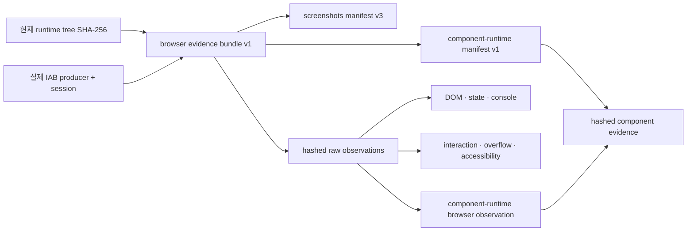

# Browser Evidence Bundle

`verify-production-ui`의 브라우저 게이트는 `production-browser-evidence-bundle/v1`만 프로덕션 증거로 인정합니다. 이 번들은 스크린샷, DOM·상태·콘솔, 상호작용, 오버플로, 접근성, 컴포넌트 런타임 검증이 한 번의 실제 Codex Desktop in-app Browser 세션에서 나왔는지 확인하기 위한 연결 장부입니다.

Python 하네스의 역할은 저장된 파일과 해시를 검증하는 데 그칩니다. 하네스가 권한이 분리된 in-app Browser를 직접 실행하거나 브라우저 세션을 증명한다고 간주해서는 안 됩니다. 실제 탐색과 캡처는 Production QA 에이전트가 `browser:browser` 스킬로 수행합니다.

## 증거 연결 구조



모든 가지가 같은 `implementation_tree.sha256`과 `browser_session.session_id`를 가져야 합니다. 런타임이 바뀌면 번들 전체를 폐기하고 새 세션에서 다시 수집합니다.

## 저장 위치와 스키마

기본 위치는 다음과 같습니다.

- 번들: `build/system/production/browser-evidence-bundle.json`
- 원시 관찰: `build/system/production/browser-observations/*.json`
- 스크린샷 매니페스트: `build/system/production/screenshots.json`
- 컴포넌트 런타임 매니페스트: `build/system/production/component-runtime-manifest.json`

번들의 필수 항목은 다음과 같습니다.

- `schema_version`: `production-browser-evidence-bundle/v1`
- `bundle_id`, `project`, timezone이 포함된 `recorded_at`
- 현재 트리와 같은 `implementation_tree.algorithm`, `sha256`, `file_count`
- `producer.kind`: `codex-desktop-in-app-browser`
- `producer.tool`: `in-app-browser`
- `producer.skill`: `browser:browser` 또는 `browser:control-in-app-browser`
- 실제 QA 실행을 구분하는 `producer.agent_run_id`, `tool_version`
- `browser_session.session_id`, `target_url`, `user_agent`, `started_at`, `ended_at`
- 경로와 SHA-256을 가진 `screenshot_manifest`, `component_runtime_manifest`
- 모든 필수 관찰을 담은 `observations`

artifact 경로는 절대 경로가 아니라 `root`와 저장소 상대 경로로 적습니다. `root`는 `project` 또는 `target-repo`만 허용합니다.

```json
{
  "root": "project",
  "path": "build/system/production/browser-observations/interaction.json",
  "sha256": "<lowercase sha256>",
  "media_type": "application/json"
}
```

## 필수 원시 관찰

스크린샷을 제외한 원시 JSON은 `production-browser-observation/v1`을 사용합니다. 각 파일에는 번들 레코드와 같은 `observation_id`, `kind`, `browser_session_id`, `implementation_tree_sha256`, `observed_at`, `producer`가 있어야 합니다.

필수 `kind`는 여덟 가지입니다.

| kind | 원시 데이터 기준 |
| --- | --- |
| `screenshot` | 검증된 스크린샷 매니페스트의 path, SHA, route, state, theme, viewport와 일치 |
| `dom` | route/state별 selector, node count, 원본 DOM snapshot SHA |
| `state` | 실제로 보이는 selector와 관찰된 상태 |
| `console` | IAB의 `tab.dev.logs()` 결과와 계산된 error count. 프로덕션은 error 0 |
| `interaction` | 대상, 동작, 전후 상태가 있는 실제 pointer/keyboard 이벤트 |
| `overflow` | 모든 검증 viewport의 `scrollWidth`, `clientWidth`, 수평 초과 픽셀. 프로덕션은 0 |
| `accessibility` | WCAG 기준, 위반 목록, keyboard/focus 점검. 프로덕션은 위반 0이고 키보드 점검 통과 |
| `component-runtime` | v1 매니페스트의 전체 component ID와 evidence SHA, 관련 DOM/state/interaction 관찰 ID |

스크린샷은 각 파일이 하나의 observation입니다. 나머지 종류는 세션 전체를 묶는 aggregate observation을 하나씩 둡니다. DOM·state·console·interaction·accessibility의 route/state coverage는 스크린샷 매니페스트와 같아야 하고, overflow viewport coverage도 일치해야 합니다.

## Production QA 실행 순서

1. 구현 트리를 고정하고 `browser:browser`를 로드합니다.
2. `iab` 브라우저를 선택하고 세션 이름을 한 번 정한 뒤 같은 세션과 tab handle을 유지합니다.
3. light/dark × mobile/desktop 화면을 실제로 캡처합니다. 필요한 viewport를 IAB가 제공하지 못하면 증거를 만들었다고 가정하지 말고 gate를 닫습니다.
4. 상태 변경 전후에 DOM snapshot과 visible state를 기록합니다. 콘솔은 `tab.dev.logs()`로 읽고, overflow와 DOM 접근성 항목은 read-only page evaluation으로 관찰합니다. 키보드와 포커스 이동은 실제 동작으로 확인합니다.
5. 각 스크린샷을 `record-screenshot-evidence`로 등록하고, 원시 관찰 JSON을 저장한 뒤 SHA-256을 계산합니다.
6. 번들에서 스크린샷 매니페스트, 원시 관찰, component-runtime v1 매니페스트와 evidence SHA를 같은 세션과 runtime tree에 연결합니다.
7. 아래 명령으로 최종 blocking gate를 실행합니다.

```bash
uv run design-ontology verify-production-ui \
  --project-dir projects/<name> \
  --target-repo <implementation-repo> \
  --browser-evidence-bundle projects/<name>/build/system/production/browser-evidence-bundle.json \
  --json
```

## Fail-closed 규칙

`production-ui-runtime-check/v1`은 사람이 쓴 `passed: true` 설명을 해시로 감싼 구형 형식입니다. aesthetic report의 과거 호환 정보로 남아 있을 수는 있지만, 브라우저 프로듀서·세션과 원시 관찰을 증명하지 못하므로 프로덕션 browser evidence로는 항상 거부합니다.

다음 중 하나라도 맞지 않으면 `browser_evidence_bundle` gate가 실패합니다.

- 번들, 매니페스트, 원시 artifact의 SHA-256
- 현재 runtime tree digest 또는 artifact freshness
- IAB producer, agent run, browser session identity
- 스크린샷 hash/route/state/theme/viewport 전체 coverage
- DOM/state/console/interaction/overflow/accessibility 원시 관찰
- component-runtime v1 manifest, component ID, evidence SHA, 관련 관찰 ID

