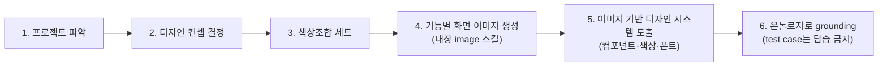

# Site Design Workflow (Image-First)

> 이 문서는 "**사이트 디자인 해줘**" 류의 요청이 들어왔을 때 따르는 **새 기본 방향**입니다.
> 기존 `IMPLEMENTATION_WORKFLOW.md`(spec → KB → synthesis → blueprint)는 **스펙 우선(spec-first)** 흐름으로 유지되며,
> 이 문서는 그 위에 얹히는 **이미지 우선(image-first)** 흐름을 정의합니다.

## 방향 전환 요약

| | 기존 (spec-first) | 새 방향 (image-first) |
|---|---|---|
| 출발점 | `spec.md` + 공식 KB | 프로젝트 내용 파악 → 디자인 컨셉 |
| 이미지의 역할 | **advisory 보조 신호** (visual reference) | **생성의 중심 산출물** (기능별 화면을 직접 생성) |
| 디자인 시스템 | 스펙/KB에서 합성 | **생성된 화면 이미지에서 역으로 도출** |
| 온톨로지 | 그래프 합성의 근거 | **어휘·관계 근거(grounding)** 로만 사용 |
| 샘플/프리셋 | 매칭·승격 대상 | **답습 금지** (test case로 취급, 복제하지 않음) |

핵심 원칙은 두 가지입니다.

1. **이미지가 먼저, 시스템은 그 다음.** 컨셉과 색상조합을 정하고, 기능별 화면을 실제 이미지로 만든 뒤, 그 이미지를 근거로 디자인 시스템(토큰·컴포넌트·폰트)을 도출한다.
2. **온톨로지는 쓰되, 우리가 만든 test case는 절대 따라가지 않는다.** `presets/`, `projects/`(glacier·signal-desk 등), `tests/fixtures`의 산출물은 **참고용 어휘 검증**까지만 본다. 그 결과물의 색/폰트/레이아웃을 그대로 가져오면 안 된다. 매 실행은 프로젝트 고유의 결정을 새로 만든다.

## 6단계



### 1. 프로젝트 내용 파악

- 입력: 사용자의 요청, 있으면 `spec.md` / `brand_profile.json`, 제품 설명.
- 산출: `concept_brief.md`의 상단 — 제품 한 줄 정의, 핵심 사용자, **기능별 화면 목록(feature surfaces)**, 톤, 안티 키워드.
- 기능별 화면 목록이 4단계 이미지 생성의 단위가 된다. (예: 랜딩, 대시보드, 상세, 작성 폼 …)

### 2. 디자인 컨셉 결정

- 제품 성격에서 **하나의 명확한 디자인 컨셉**을 고른다. (예: "Field Guide Naturalism", "Cool Operations Minimal")
- 컨셉은 한 문장 + 3~5개 형용사 + 명시적 anti-pattern으로 고정한다.
- 온톨로지(`semantic_color_ontology.json`, 22-노드 graph schema)의 keyword/mood 어휘로 컨셉을 **검증**한다. 컨셉을 프리셋에서 고르지 않는다.

### 3. 어울리는 색상조합 세트

- 컨셉 + 제품 mood로 **색상조합 세트**(dominant / supporting / neutral / accent + 상태색)를 만든다.
- `color_reference.py` / `semantic_color_selector.py`의 `ontology-search-per-run`을 근거로 쓰되, **미리 만든 팔레트를 그대로 쓰지 않는다.**
- 산출: `color_set.json` — 후보 1~3개, 각 role별 hex와 의도, WCAG 대비 메모.
- 이 색상 세트가 4단계 이미지 프롬프트의 색 지침이 된다.

### 4. 기능별 화면을 이미지 스킬로 생성

- **내장 GPT Image 2 스킬**(`generate_image`, 모델 `gpt_image_2`, `aspect_ratio: "16:9"`, `resolution: "2k"`, `quality: "high"`)로 1단계의 기능별 화면을 **각각** 생성한다.
- 프롬프트에는 반드시 포함한다:
  - 컨셉 문장 + 형용사
  - 3단계 색상조합(역할별 hex)
  - 화면의 기능 구성(존재해야 하는 컴포넌트/영역)
  - **UI mockup / product screen** 임을 명시 (사진·일러스트 단독이 아니라 인터페이스)
  - anti-keyword (예: "no stock-photo collage, no emoji icons, no default Tailwind blue")
- 산출: `generated/<surface>.png` + `screen_plan.json`(각 화면의 prompt, job_id, 의도, 포함 컴포넌트).
- 이미지 바이너리를 로컬로 받을 수 없는 환경(예: asset CDN egress 차단)에서는 `screen_plan.json`에 `url` + `job_id`를 **원격 출처(provenance)** 로 기록한다. `check-site-design`는 로컬 파일이 없어도 `url`+`job_id`가 있으면 유효 증거로 인정한다.
- 같은 컨셉·색상으로 화면 간 **일관성**을 유지한다. (헤더·타이포·코너·밀도가 화면마다 튀지 않게)

### 5. 이미지 기반 디자인 시스템 도출

- 생성된 화면 이미지를 **직접 보고** 디자인 시스템을 역으로 도출한다.
  - **색상**: 화면에 실제로 쓰인 surface/text/accent/state 색 → semantic token으로 정리(3단계 색상 세트와 대조해 확정).
  - **폰트**: 화면의 display/heading/body 타이포 무드 → `font_reference.py` 어휘로 실제 서체 조합 선택.
  - **컴포넌트**: 화면에 등장한 컴포넌트(헤더, 카드, 테이블, 폼, CTA …)와 그 상태/anatomy.
  - **조형 언어**: corner/elevation/density/surface style.
- 산출(구현 repo가 소비하는 표준 포맷 그대로):
  - `design-system/token_schema.json`
  - `design-system/component_inventory.json`
  - `design-system/system_spec.md`
  - `design-system/STYLE.md` (에이전트가 먼저 읽는 캡슐)
- 이미지에서 도출했음을 provenance로 남긴다: `derived_from: generated-screens`, 각 토큰에 출처 화면.

### 6. 온톨로지로 grounding (test case 답습 금지)

- 도출된 시스템을 온톨로지 어휘/관계로 **검증·보강**한다:
  - color token ↔ `semantic_color_ontology` keyword/mood
  - component ↔ graph schema의 ComponentFamily / has_state / requires(accessibility)
  - contrast_pair로 WCAG 재확인
- **금지선 (하드 룰):**
  - `presets/*`, 기존 `projects/*`, `tests/fixtures/*`의 token/색/폰트/레이아웃을 **복사하지 않는다.**
  - preset matcher로 "비슷한 프리셋"을 찾아 그 산출물을 채워 넣지 않는다.
  - 온톨로지는 **무엇이 유효한 관계인지** 알려주는 용도이지, **무엇을 그릴지** 정해주는 카탈로그가 아니다.
- 검증만 통과하면 끝. 결과물은 이 프로젝트의 생성 이미지에서만 나온 고유 시스템이어야 한다.

## 산출물 디렉터리 구조

`init-site-design`가 만드는 구조:

```
projects/<slug>/
  brand_profile.json          # 1단계 입력 (제품 정체성)
  project_manifest.json       # workflow: "site-design-image-first"
  concept_brief.md            # 1~2단계: 파악 + 컨셉
  color_set.json              # 3단계: 색상조합 세트
  screen_plan.json            # 4단계: 화면별 prompt / job_id / 컴포넌트
  generated/                  # 4단계: 생성된 화면 이미지(png)
  design-system/              # 5~6단계: 도출된 시스템
    token_schema.json
    component_inventory.json
    system_spec.md
    STYLE.md
```

## CLI 보조

이미지 생성 자체는 에이전트가 내장 이미지 스킬로 수행하지만, 스캐폴딩과 검증은 CLI가 돕는다.

```bash
# 1) 프로젝트 스캐폴드 (image-first 구조 + 템플릿)
uv run design-ontology init-site-design \
  --project-dir projects/<slug> \
  --brand-name "..." \
  --product-summary "..." \
  --concept "..." \
  --surface 랜딩 --surface 대시보드 --surface 상세

# 2) (4단계 후) 화면 계획과 생성 이미지 정합성 점검
uv run design-ontology check-site-design --project-dir projects/<slug>
```

`check-site-design`는 다음을 확인한다.

- `screen_plan.json`의 각 surface에 대응하는 `generated/*.png`가 존재하는지
- `color_set.json`의 hex가 유효한지, 도출된 `token_schema.json`이 그 색상 세트에 근거하는지
- preset/기존 project 산출물과 **token이 그대로 일치하면 경고** (test case 답습 탐지)

## 에이전트 실행 규칙 요약

1. 6단계를 **순서대로** 따른다. 이미지(4단계) 없이 시스템(5단계)을 만들지 않는다.
2. 이미지 생성은 내장 GPT Image 2 스킬 사용: `generate_image`, 모델 `gpt_image_2`, `16:9`, `2k`, `quality: high`.
3. 온톨로지는 grounding/검증에만. 프리셋·기존 프로젝트·fixtures는 **복제 금지**.
4. 모든 도출 결과에 출처(생성 화면)를 남긴다.
