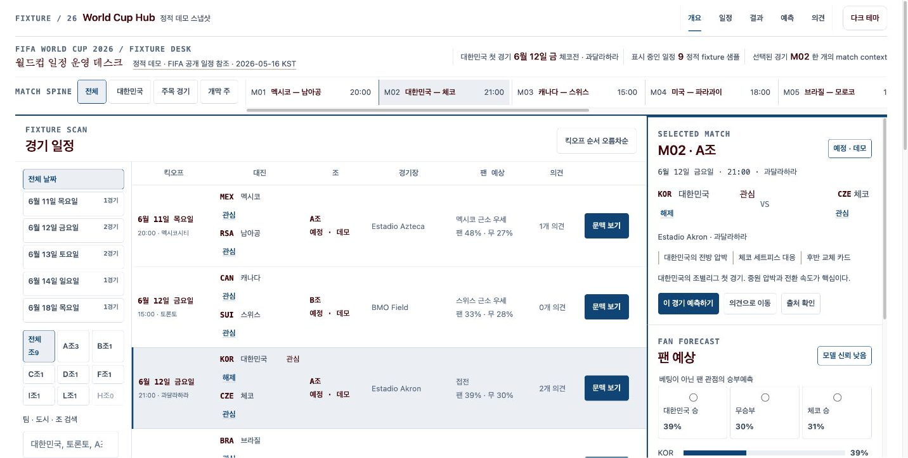
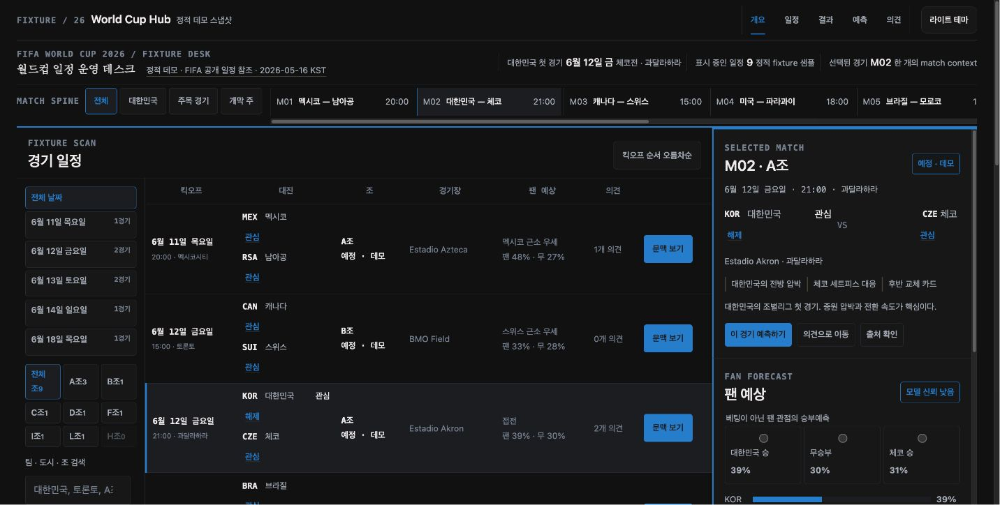
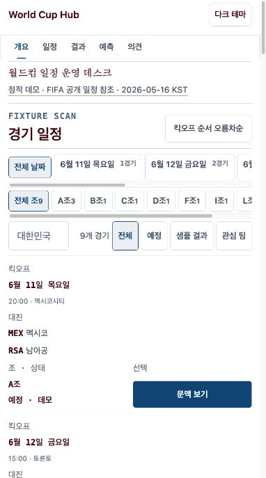
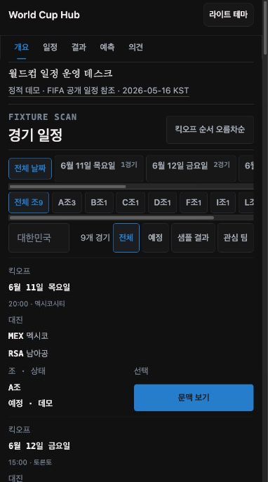

# Fixture Desk iteration 2 — Production QA

검증 런타임: `cf3e1b0d232bd80fc072a4c92d240f4ceeaf1cd448618fba86a9a5fc085fb1f6`

판정: **QA 보류**. 시각 품질, 핵심 상호작용, 반응형 넘침, 콘솔 상태는 현재 런타임에서 양호했다. 다만 Production QA 에이전트에 in-app Browser가 직접 노출되지 않아 Team Lead가 전달한 새 관찰을 검토하는 방식으로 진행했다. 현재 런타임의 연속 Tab 이동과 focus-visible 상태는 다시 실행하지 못했으므로 접근성·브라우저 증거·컴포넌트 런타임 증거를 통과로 기록하지 않는다.

## 캡처

1. **Light desktop — 양호**  
   

   필터 축, 일정표, 선택 경기 rail이 한 화면에서 명확히 분리된다. 선택 행의 배경과 왼쪽 강조선이 rail의 `M02 · A조` 문맥과 직접 이어져 핵심 작업을 빠르게 파악할 수 있다.

2. **Dark desktop — 양호**  
   

   light와 동일한 정보 위계와 상태 표현을 유지한다. 본문·보조 문구·선택 상태의 명도 차이는 안정적이며, 행동 버튼은 배경에서 충분히 분리된다.

3. **Light mobile — 양호, 후속 확인 필요**  
   

   nav와 필터는 내부 가로 스크롤로 보존되고 페이지 자체의 가로 넘침은 없다. 첫 경기의 팀·시간·상태·행동이 첫 화면에 들어온다. 선택 경기 상세는 아래쪽 흐름에 있어 첫 화면에서는 확인할 수 없다.

4. **Dark mobile — 양호, 후속 확인 필요**  
   

   light와 같은 재배치 규칙을 유지한다. 어두운 표면에서도 활성 필터와 `문맥 보기` 행동이 분명하다.

## 흐름 검증

5. **경기 선택 → 문맥 rail — 통과**  
   현재 DOM에서 `MEX 멕시코 RSA 남아공` 행과 그 안의 `문맥 보기` 버튼이 각각 하나로 확인됐다. 실행 뒤 `data-selected-match-id`가 `m01`로 바뀌고 rail 제목이 `M01 · A조`, 선택 행 수가 1개로 동기화됐다.

6. **팀 검색 — 통과**  
   `팀 · 도시 · 조 검색` searchbox에 `대한민국`을 입력했을 때 표시 행이 정확히 2개로 줄었고 두 행 모두 대한민국을 포함했다.

7. **테마 전환 — 통과**  
   테마 버튼은 하나이며 light와 dark를 오갔다. 접근 가능한 이름도 다음 행동에 맞춰 `다크 테마로 전환`과 `라이트 테마로 전환`으로 바뀌었다.

8. **반응형·콘솔 — 통과**  
   1432px, 795px, 382px에서 페이지 가로 넘침은 0px였다. 795px에서는 일정표가 단일 흐름으로 바뀌었고 첫 경기 행이 유지됐다. 현재 앱의 console warn/error 결과는 비어 있었다.

9. **구조·접근성 — 보류**  
   skip link, banner, primary navigation, main, `경기 일정` region, 이름 있는 표와 column header, `선택 경기 문맥` complementary landmark, 예측 radio, 의견 textbox·combobox는 확인됐다. 하지만 전체 키보드 Tab 순서와 focus-visible 상태를 현재 런타임에서 직접 재실행하지 못했다. 스크린샷과 정적 DOM만으로 WCAG 2.2 AA나 키보드 접근성을 통과로 판정하지 않는다.

   정적 소스의 첫 8개 native focusable은 skip link, `개요/일정/결과/예측/의견`, 테마 전환, 출처 메모 순서다. 양의 `tabindex`는 없고 프로그램 방식의 초점 대상에만 `tabindex=-1`을 쓴다. 공통 `:focus-visible`에는 2px Semantic OS 링크색 outline과 4px offset이 있다. 이는 구조적 근거일 뿐 live Tab 검증을 대신하지 않는다.

## 시각 품질 요약

- 일정 탐색이 마케팅 요소보다 앞서고, 스포츠 운영 화면에 맞는 높은 정보 밀도를 유지한다.
- 데스크톱의 비대칭 작업대와 모바일의 순차 카드 흐름이 같은 작업 순서를 보존한다.
- Semantic OS 색 역할이 light·dark에서 일관되고, 선택 상태는 색상뿐 아니라 배경·선·텍스트로 반복된다.
- 모바일에서 선택 경기 상세가 첫 viewport 아래에 시작한다. 직접 문맥 행동은 유지되지만, 향후 변경 시 이 위치를 더 아래로 밀지 않는 편이 안전하다.

## 증거 한계

- 네 스크린샷은 fidelity 단계에서 최종 런타임으로 캡처한 파일을 byte-identical하게 승격했다. production 매니페스트와 fidelity 매니페스트의 SHA-256 집합은 같다.
- 브라우저 관찰은 같은 최종 런타임에서 Team Lead가 새로 실행해 전달했다. Production QA 에이전트가 in-app Browser 세션을 직접 소유하지 못했으므로 provenance 위험을 해소하지 못했다.
- 키보드 포커스 검증이 빠진 상태에서는 browser evidence bundle과 component-runtime manifest를 새 통과 증거로 재발행하지 않는다.

## 게이트 결과

- 통과: component contracts 19/19, implementation lint 0 issues, screenshot evidence, reference fidelity, style divergence.
- standalone aesthetic loop: iteration 2가 90.19점으로 82점 기준을 통과했다. 접근성 관련 점수는 live keyboard 증거 부재를 반영해 낮췄다.
- 보류: component-runtime conformance. 기존 manifest와 19개 evidence가 이전 `d36cdade…` 런타임에 묶여 있어 현재 `cf3e1b0…`와 맞지 않는다.
- 보류: browser evidence bundle. 기존 번들의 런타임·스크린샷·관찰 시각이 모두 현재 구현보다 오래됐다.
- 보류: production aesthetic evidence. interaction·overflow는 통과했지만 accessibility runtime check는 `blocked`이며 keyboard assertion은 `passed: false`다.
- 전체 `verify-production-ui`: 실패. Release Governor로 넘기는 handoff는 작성하지 않았다.
